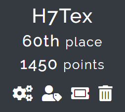
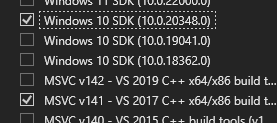
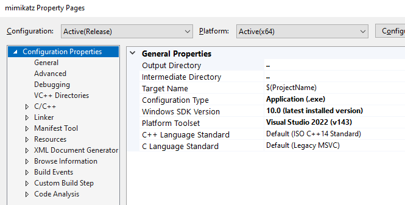
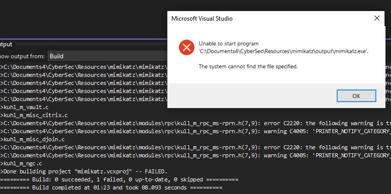
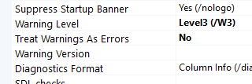
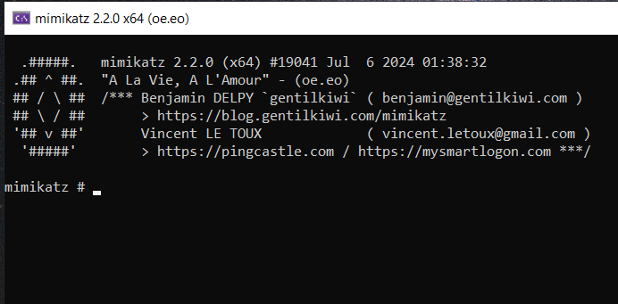
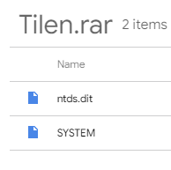
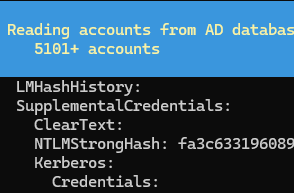
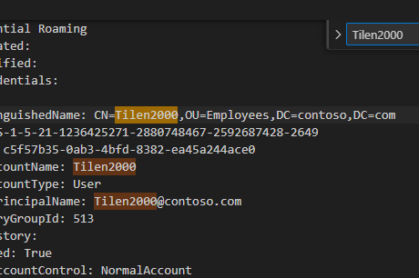
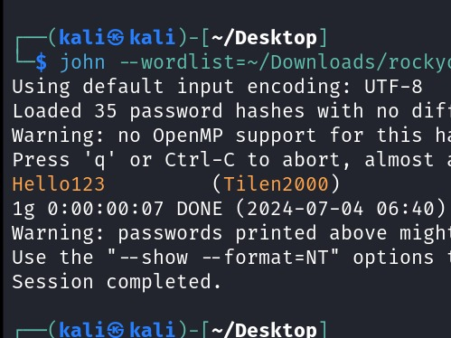

Well, another day, another CTF. We, `H7Tex` placed 60th overall.

```jsx
Authors: AbuCTF, Rohmat, MrGhost, MrRobot, PattuSai
```



## Forensics

### **Admin rights**

**Description**: Help me understand which ACTIVE account has administrator rights Account of the form **user_xxxx**

Flag in the format **grodno{user_xxxx}**

Given: `SAM`

```bash
┌──(abu㉿Abuntu)-[/mnt/c/Documents4/CyberSec/JuniorCryptCTF]
└─$ file SAM
SAM: MS Windows registry file, NT/2000 or above
```

Since it’s a registry file, and we need to find the admin account. I tried using tools like `samdump2`, `pwdump`, or similar tools designed to extract user account information from SAM files. But in vain. Here’s a bit into what I’m talking about.

**SAM File (Security Account Manager):**

- The SAM file stores user account information and passwords in a hashed format on Windows systems.
- Location: Typically found in `C:\Windows\System32\config\SAM`.
- The SAM file is locked while Windows is running to prevent tampering.

**SYSTEM File:**

- The SYSTEM file contains system-wide settings and configuration information.
- Location: Typically found in `C:\Windows\System32\config\SYSTEM`.
- This file includes the system's startup configuration and other vital system settings.

**samdump2:**

- **Purpose:** samdump2 is a tool used to extract hashed password information from the SAM file using data from the SYSTEM file.
- **Function:** It works by accessing the `Boot Key` from the SYSTEM file, which is then used to decrypt the hashed passwords stored in the SAM file.
- **Usage:** Commonly used in forensic investigations and penetration testing to recover Windows user passwords.

**How it Works**

1. **Extract SYSTEM File Information:**
    - The SYSTEM file contains the `Boot Key` necessary for decrypting the SAM file.
2. **Decrypt the SAM File:**
    - samdump2 uses the `Boot Key` from the SYSTEM file to decrypt the password hashes stored in the SAM file.
3. **Retrieve Password Hashes:**
    - Once decrypted, samdump2 outputs the password hashes in a format that can be further analyzed or cracked using tools like `John the Ripper` or `hashcat`.

Practical Usage

- **Prerequisites:**
    - You need access to the SYSTEM and SAM files, which usually requires administrative privileges.
    - The files are typically accessed from a different OS or a bootable USB to bypass Windows file locks.
- **Command:**
    - The basic usage of samdump2 is:
        
        ```bash
        samdump2 SYSTEM SAM > hashes.txt
        ```
        
    - This command extracts and saves the password hashes to a file named `hashes.txt`.
    - You can also manually analyze the `SAM` file using tools like `Regedit` on a Windows system or specialized registry analysis tools. BTW, here’s a tip.
    
    
    

Also, tried 

**Impacket's secretsdump.py**:

- This tool can extract password hashes directly from the `SAM` file without requiring the `SYSTEM` file.
- Example command:
    
    ```bash
    secretsdump.py -sam SAM -outputfile output.txt
    ```
    
- Replace `SAM` with the path to your `SAM` file and `output.txt` with the desired output file name.

Well, at the end I used the `chntpw` tool.

**Offline NT Password & Registry Editor (chntpw):**

- **Purpose:** A utility for resetting or removing passwords for local accounts on Windows systems. It can also edit the Windows registry offline.
- **Function:** It works by directly modifying the SAM file to remove or reset the password hashes of user accounts.

We can install it using APT.

```bash
sudo apt install chntpw
```

Then using the command, we list the users on the registry.

```bash
┌──(abu㉿Abuntu)-[/mnt/c/Documents4/CyberSec/JuniorCryptCTF]
└─$ chntpw -l SAM
chntpw version 1.00 140201, (c) Petter N Hagen
Hive <SAM> name (from header): <\SystemRoot\System32\Config\SAM>
ROOT KEY at offset: 0x001020 * Subkey indexing type is: 666c <lf>
File size 786432 [c0000] bytes, containing 89 pages (+ 1 headerpage)
Used for data: 6162/529968 blocks/bytes, unused: 50/118448 blocks/bytes.

| RID -|---------- Username ------------| Admin? |- Lock? --|
| 042a | user_10052                     |        | *BLANK*  |
| 0470 | user_10133                     |        | *BLANK*  |
| 0480 | user_10196                     |        | *BLANK*  |
<Other USERS>
| 0444 | user_7505                      |        | *BLANK*  |
| 0516 | user_7565                      | ADMIN  | *BLANK*  |
| 05c0 | user_7616                      |        | *BLANK*  |
```

And there you have it, the active user account with admin privileges.

Flag:  `grodno{user_7565}`

### **Banishment**

Check out the `pwdump` saga. It’s pretty cool evolution.

[Windows PWDUMP tools](https://www.openwall.com/passwords/windows-pwdump)

```bash
┌──(abu㉿Abuntu)-[/mnt/c/Documents4/CyberSec/JuniorCryptCTF/pwdump8]
└─$ ./pwdump8.exe -f SAM

PwDump v8.2 - dumps windows password hashes - by Fulvio Zanetti & Andrea Petralia @ http://www.blackMath.it

error: must specify at least SYSTEM and SAM in file dump
```

Sad, we need the SYSTEM or this tool to work. Moving on.

Tried `DS-Internals` module in PowerShell. No good.

Running `pwdump5` gave up a NTLM hash.

```bash
┌──(abu㉿Abuntu)-[/mnt/c/Documents4/CyberSec/JuniorCryptCTF/pwdump5]
└─$ ./pwdump5.exe -f SAM

[ Pwdump5 ]

Copyright (c) 2004 AntonYo!
All rights reserved.

user_10052:1066:00000000000000000000000000000000:00000000000000000000000000000000:::
user_10133:1136:00000000000000000000000000000000:00000000000000000000000000000000:::
user_10196:1152:00000000000000000000000000000000:00000000000000000000000000000000:::
user_9979:1456:00000000000000000000000000000000:00000000000000000000000000000000:::
?????????????:500:00000000000000000000000000000000:c7363f755a403c2d6df08dee03e31fcc:?????????? ??????? ?????? ?????????????? ??
????????/??????::
?????:501:00000000000000000000000000000000:00000000000000000000000000000000:?????????? ??????? ?????? ??? ??????? ?????? ? ????
?????? ??? ??????::
```

Tried cracking it using `hashcat`

```bash
Session..........: hashcat
Status...........: Exhausted
Hash.Mode........: 1000 (NTLM)
Hash.Target......: c7363f755a403c2d6df08dee03e31fcc
Time.Started.....: Fri Jul  5 23:10:32 2024 (0 secs)
Time.Estimated...: Fri Jul  5 23:10:32 2024 (0 secs)
Kernel.Feature...: Pure Kernel
Guess.Base.......: File (../rockyou-75.txt)
Guess.Queue......: 1/1 (100.00%)
Speed.#1.........:   420.2 kH/s (0.12ms) @ Accel:256 Loops:1 Thr:1 Vec:8
Recovered........: 0/1 (0.00%) Digests (total), 0/1 (0.00%) Digests (new)
Progress.........: 59186/59186 (100.00%)
Rejected.........: 0/59186 (0.00%)
Restore.Point....: 59186/59186 (100.00%)
Restore.Sub.#1...: Salt:0 Amplifier:0-1 Iteration:0-1
Candidate.Engine.: Device Generator
Candidates.#1....: kaylak -> 171183

Started: Fri Jul  5 23:09:59 2024
Stopped: Fri Jul  5 23:10:34 2024
```

No progress. Let’s try the OG `Mimikatz`.

https://github.com/gentilkiwi/mimikatz

```bash
┌──(abu㉿Abuntu)-[/mnt/c/Documents4/CyberSec/Resources/mimikatz]
└─$ ls
appveyor.yml  kiwi_passwords.yar  mimicom.idl  mimikatz      mimilib   mimispool  notrunk.lst  trunk.lst
inc           lib                 mimidrv      mimikatz.sln  mimilove  modules    README.md
```

In here, the thing we want to concentrate is the `mimikatz.sln` file. In the context of software development, especially with Microsoft technologies, a `.sln` file refers to a **Solution file**. Install Visual Studio with Desktop Development with C++ [ I also selected  Linux and embedded development with C++, just for the heck of it and it was only 0.08 GB ]. After that import the  `mimikatz.sln` file into visual studio. Also select the Windows 10 SDK and MSVC `v141`build tools as it’s required. Also select MFC and ATL support (x86 and x64) from individual components.





Set the platform to x64 or any other platform. Configure other stuff and you’re good to go.

Ah. Something keeps failing.




Dude ! Finally, some progress.


Turns out, you have to set the treat warnings as errors to no.



At long long last.



Also turn off Real-Time Virus Protection on Windows while your running it, you know why.


```bash
┌──(abu㉿Abuntu)-[/mnt/c/Documents4/CyberSec/Resources/mimikatz/output]
└─$ sudo ./mimikatz.exe

  .#####.   mimikatz 2.2.0 (x64) #19041 Jul  6 2024 01:38:32
 .## ^ ##.  "A La Vie, A L'Amour" - (oe.eo)
 ## / \ ##  /*** Benjamin DELPY `gentilkiwi` ( benjamin@gentilkiwi.com )
 ## \ / ##       > https://blog.gentilkiwi.com/mimikatz
 '## v ##'       Vincent LE TOUX             ( vincent.letoux@gmail.com )
  '#####'        > https://pingcastle.com / https://mysmartlogon.com ***/

mimikatz # privilege::debug
Privilege '20' OK
```

Now, that I’m here. Let’s look at the security of my own system. Turns out, it’s trash. I keep crazy passwords for my online accounts and keep a baby one for the local machine. I used this one as reference, trying to reveal without the `token::elevate` doesn’t work

```bash
mimikatz # token::elevate
Token Id  : 0
User name :
SID name  : NT AUTHORITY\SYSTEM

844     {<>} 0 D 87666          NT AUTHORITY\SYSTEM     <>        (04g,31p)       Primary
 -> Impersonated !
 * Process Token : {<>} 2 F 73346244    ABUNTU\Abu      <>  (14g,24p)     P
rimary
 * Thread Token  : {<>} 0 D 73744278    NT AUTHORITY\SYSTEM     <>        (04g,31p)       Impersonation (Delegati
on)

mimikatz # sekurlsa::logonpasswords

Authentication Id : 0 ; <>(00000000:<>)
Session           : Service from 0
User Name         : <>
Domain            : NT VIRTUAL MACHINE
Logon Server      : (null)
Logon Time        : 05-07-2024 22:03:00
SID               : <>
        msv :
        tspkg :
        wdigest :
         * Username : ABUNTU$
         * Domain   : WORKGROUP
         * Password : (null)
```

Crazy, am having goosebumps ! Looking around I find the NT-Authority(ADMIN) NTLM hash. Out of curiosity I try to brute force it. And it came back with hits in both(John/Hashcat) of them. Even in CrackStation. 


Well, let’s back to this challenge later.

### **Series SAM**

**Description:** Your task is to extract the password of the Tilen2000 user.

Flag format: **grodno{password_plain_text}**

For example, **grodno{password_12345}**

**Given**: 

https://drive.google.com/file/d/1HhRrMltyngvV5WwrlCxYAczPrtiEfp6S/view?usp=sharing



We are given two files. `ntds.dit` and the `SYSTEM` file. NTDS.DIT stands for New Technology Directory Services Directory Information Tree. It serves as the primary database file within Microsoft’s Active Directory Domain Services (AD DS). NTDS.DIT is typically located in the `%SystemRoot%\NTDS` directory on domain controllers (DCs).

```bash
┌──(abu㉿Abuntu)-[/mnt/c/Documents4/CyberSec/JuniorCryptCTF]
└─$ unrar x Tilen.rar

UNRAR 7.01 beta 1 freeware      Copyright (c) 1993-2024 Alexander Roshal

Extracting from Tilen.rar

Extracting  ntds.dit                                                  OK
Extracting  SYSTEM                                                    OK
All OK
```

Since, we’ve been given the `ntds.dit` file, we can go ahead and use **`DSInternals`**: This PowerShell module provides cmdlets like `Get-ADDBAccount` that can work with the NTDS.DIT file.

[Extracting Password Hashes from the Ntds.dit File](https://blog.netwrix.com/2021/11/30/extracting-password-hashes-from-the-ntds-dit-file/)

Use the following code. To extract the password for all users in DB.

```bash
PS C:\Documents4\CyberSec\JuniorCryptCTF> Get-ADDBAccount -All -DatabasePath 'C:\Documents4\CyberSec\JuniorCryptCTF\ntds.dit' -BootKey (Get-BootKey -SystemHivePath 'C:\Documents4\CyberSec\JuniorCryptCTF\SYSTEM') | more

DistinguishedName: CN=Administrator,CN=Users,DC=contoso,DC=com
Sid: S-1-5-21-1236425271-2880748467-2592687428-500
Guid: b3d02974-6b1c-484c-9103-fd2f60d592c4
SamAccountName: Administrator
SamAccountType: User
UserPrincipalName:
PrimaryGroupId: 513
SidHistory:
Enabled: True
UserAccountControl: NormalAccount, PasswordNeverExpires
SupportedEncryptionTypes:
AdminCount: True
Deleted: False
LastLogonDate: 18-11-2019 16:20:39
DisplayName:
GivenName:
Surname:
Description: Built-in account for administering the computer/domain
ServicePrincipalName:
SecurityDescriptor: DiscretionaryAclPresent, SystemAclPresent, DiscretionaryAclAutoInherited, SystemAclAutoInherited,
DiscretionaryAclProtected, SelfRelative
Owner: S-1-5-21-1236425271-2880748467-2592687428-512
Secrets
  NTHash: 92937945b518814341de3f726500d4ff
```

BTW, the here’s the admin pass.


Now, let’s find the Tilen2000 user hash.



Forward the command to a text file and search for the user `Tilen2000`.



Got em ! now, let’s move into cracking the NTML hash.




Flag: `grodno{Hello123}`


