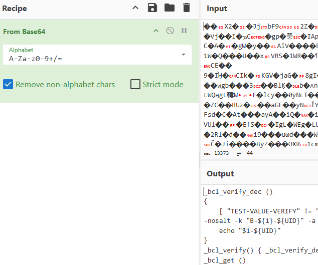

Another weekend, another CTF, this time it was `NahamCon`. Even though it had lots of web challenges, it also presented some quality challenges from other categories, also on that note, recently I feel I've hit a wall and it's really frustrating, hereon I should refrain from jumping into every single CTF, and cap it at one or two CTFs every weekend, and try to all-clear it, making write-ups along the way, I want to double down on rev and pwn, while still keeping tabs on the rest. Note to self!


## Reverse Engineering

### It's Locked [Medium]

Author: `@Kkevsterrr`

Description: This bin looks locked as a crypt to me, but I'm sure you can work some magic here. All I know is that this came from a machine with a cryptic ID of just 'hello'.

Given: `flag.sh`

```bash
└─$ file flag.sh 
flag.sh: POSIX shell script executable (binary data)
```

We are given an incredibly obfuscated shell script, just by catting the file, we are able to see tons of unreadable text, also bits of information so we can derive from it like some eval functions usage of `perl`, setting those aside, these unreadable text can also be taken as unprintable text, we can use `bash -x` to print them out.


💡 **-x**        Print commands and their arguments as they are executed.

Before that I learnt that `||` or the OR operator is a common obfuscation technique to hide what is actually being executed in the script, It's used to execute a command only if the preceding command fails (returns a non-zero exit status). While it's not directly an obfuscation technique, it can be used creatively within obfuscated scripts to make the logic harder to follow. Here’s a sample program to understand this.

```bash
└─$ cat sample.sh
#!/bin/bash
false || echo "This will execute"
true || echo "This won't execute"

┌──(abu㉿Winbu)
└─$ bash sample.sh
This will execute
```

Another operator of interest is `:`. In Bash, the colon (`:`) operator is a null command. It does nothing and always returns an exit status of 0, indicating success. When a command is required syntactically, but no action is needed, the colon can be used as a placeholder. 

```bash
     if [ condition ]; then
       :  # No action needed if condition is true
     else
        echo "Condition is false"
     fi
```

Putting these together, `: ||` ignores whatever command comes after it.

```bash
: || echo "This won't print"
```

This is usually done to increase the complexity of the obfuscated shell script, by inserting non-functional ****noise that looks like code, and it's often used as a junk filler to throw off analysis. Now, usually strings we find a similar pattern. 

```bash
└─$ strings flag.sh 
#!/bin/sh
';eval`:||
` "`:||
`$(`:||
`ec`#
`ho `:||
|LANG=C perl`:||
` -pe`#
` "s`#
`/[^`:||
`[`#
`:pr`:||
`in`#
`t:`#
`]]`:||
`//g"`#
`|`#
`ope`:||
`n`#
`ssl `:||
`ba`:||
`se`:||
`64 -`:||
`A -`:||
`d`#
`)`:||
```

After some cleaning up we get the following command, `eval $(echo <>| LANG=C perl -pe "s/[^[:print:]]//g" | openssl base64 -A -d")`. Looking at the one-liner, let’s break it down, `LANG=C` ensures that Perl uses the POSIX character classes, avoiding locale-specific behavior, and `perl -pe 's/[^[:print:]]//g'` is just a regex to printout a clean printable ASCII string, then then of course decoding it by base64.

[Perl Regular Expression Character Classes](https://perldoc.perl.org/perlrecharclass)

Let’s try to clean the clobbered up base64 string, just open it up in any editor and extract the bytes and paste it in another file for further analysis. I wrote a script to clean up and decode the base64, but you can always use other online tools like `cyberchef`.

```python
import base64
import re

with open("rough.txt", "rb") as f:
    data = f.read()

cleaned = re.sub(rb'[^A-Za-z0-9+/=]', b'', data)
decoded = base64.b64decode(cleaned, validate=True)

with open("payload.sh", "wb") as f:
    f.write(decoded)
```



But why the round-about way of doing things, if you can just use the original command. LMAO.

```bash
cat rough.txt | LANG=C perl -pe 's/[^[:print:]]//g' | openssl base64 -A -d > payload.sh
```

Instead of pasting the entire `payload.sh` file here, here’s the gist of it.

[Obfuscated Shell Script [NahamCon]](https://gist.github.com/AbuCTF/8fbb4b4d45d3920d64d091a05812e050)

Now based on this code, we spend quite a while analyzing the script and how the control flow works, then we can come to a conclusion that `machine-id` and `UID` are being checked to derive the flag. Before we dive into the explanation, let’s find out what the variables are exactly, now looking a the description, it is clear that the `machine-id` is “hello” and as for the UID, we need to brute-force it and it comes out to be `1338` [from the `_bcl_verify_dec` function].

```bash
#!/bin/bash

BCV='93iNKe0zcKfgfSwQoHYdJbWGu4Dfnw5ZZ5a3ld5UEqI='
i=0
while [ "TEST-VALUE-VERIFY" != "$(echo "$BCV" | openssl enc -d -aes-256-cbc -md sha256 -nosalt -k "B-hello-${i}" -a -A 2>/dev/null)" ]; do
  ((i++))
done
echo "Found matching UID: $i"
```

The script[not the one above but the actual obfuscated script] specifically checks for `machine-id` and `UID` in the `_bcl_get` and `_bcl_verify_dec` functions. These functions are designed to create a dynamic encryption key based on the environment where the script is executed.

1. **Checking for `UID` (User ID):**
    
    Inside the `_bcl_get` function, at the very beginning:
    
    ```bash
    _bcl_get (){
        [ -z "$UID" ] && UID="$(id -u 2> /dev/null)";
    }
    ```
    
    In here `[ -z "$UID" ]`: This checks if the `UID` shell variable is empty or unset, then this line, `UID="$(id -u 2> /dev/null)"`: If `UID` is empty, the script executes the `id -u` command.
    
    `id -u` is a standard Linux command that prints the **numeric User ID (UID)** of the current effective user. For example, `id -u` for the `root` user is usually `0`, and for a regular user like `hacker` with UID `1338`, it would print `1338`. Therefore, the `UID` variable (which holds the output of `id -u`) is then directly used in the key generation for `_bcl_verify_dec` as `B-${1}-${UID}`. If the `UID` isn't `1338`, the generated key will be wrong, and the decryption will fail.
    
2. **Checking for `machine-id`:**
    
    Also inside the `_bcl_get` function, it's the *first and preferred* source it tries:
    
    ```bash
    _bcl_get (){
    		<>
        [ -f "/etc/machine-id" ] && _bcl_verify "$(cat "/etc/machine-id" 2> /dev/null)" && return;
        <>
    }
    ```
    
    Looking at `[ -f "/etc/machine-id" ]`: This checks if the file `/etc/machine-id` exists and is a regular file. This file on Linux systems typically stores a unique ID for the machine, then `_bcl_verify "$(cat "/etc/machine-id" 2> /dev/null)"`: If the file exists, the script reads its content using `cat "/etc/machine-id"` and passes that content as the first argument (`$1`) to the `_bcl_verify` function (which, in turn, calls `_bcl_verify_dec`).
    
    **Why it's crucial:** The content read from `/etc/machine-id` becomes the "MACHINE_ID" part of the encryption key `B-MACHINE_ID-UID`. The challenge description hints at "hello" as the cryptic ID, making `/etc/machine-id` the most likely target. If the content of `/etc/machine-id` isn't "hello", the key will be wrong, and decryption will fail.
    
3. **The Verification (The "Test"):**
Both the `machine-id` (passed as `$1`) and the `UID` are combined to form a specific key used to decrypt a known "test" value (`BCV`).
    
    In the `_bcl_verify_dec` function:
    
    ```bash
    _bcl_verify_dec () {
        [ "TEST-VALUE-VERIFY" != "$(echo "$BCV" | openssl enc -d -aes-256-cbc -md sha256 -nosalt -k "B-${1}-${UID}" -a -A 2> /dev/null)" ] && return 255;
        echo "$1-${UID}"
    }
    ```
    
    The script takes the potential `machine-id` (`$1`) and the `UID` (from the current user) and constructs a key like `B-hello-1338`. It then uses this key to decrypt the hardcoded `BCV` variable. If the decryption of `BCV` *does not* result in the exact string "TEST-VALUE-VERIFY", the `[ ... ] && return 255` part triggers, and the function returns an error (255). This means the `_bcl_get` function will fail, and the entire decryption chain will halt.
    
    If the decryption *does* result in "TEST-VALUE-VERIFY", then the `_bcl_verify_dec` function is satisfied, and it returns the string `"${1}-${UID}"` (e.g., "hello-1338"), which is then used as `_k` to decrypt the `P` variable.
    

In essence, the script is performing a self-check: "Is this script running on the 'intended' machine (with the 'hello' machine-id) and by the 'intended' user (with UID 1338)?".

That was quite an explanation, now to proceed, there are two options, one is to keep going the rabbit hole of manual static analysis or we can just spin up a machine with the expected environment variables, docker would be perfect for this use-case. Credits to `@x3ero0`.

```bash
└─$ docker --version
Docker version 28.1.1, build 4eba377

┌──(abu㉿Winbu)
└─$ docker pull ubuntu
Using default tag: latest
latest: Pulling from library/ubuntu
0622fac788ed: Pull complete
Digest: sha256:6015f66923d7afbc53558d7ccffd325d43b4e249f41a6e93eef074c9505d2233
Status: Downloaded newer image for ubuntu:latest
docker.io/library/ubuntu:latest
```

I’m here in WSL2, just follow the instructions in the following to step it up.

[DockerWSL](https://docs.docker.com/desktop/features/wsl/)

Now, we run a new Ubuntu container, mounting the current directory. `-it` flag allocates a pseudo-TTY and `-v $(pwd):/shared` mounts the current WSL directory into /shared in the container.

```bash
└─$ docker run -it -v "$(pwd)":/shared ubuntu
root@2b7d209f5459:/#
```

As always, update the container and install the dependencies for the shell script like `openssl` and so on, then create a new user and follow along to get the flag.

```bash
root@2b7d209f5459:/# useradd abu
root@2b7d209f5459:/# usermod -u 1338 abu   
root@2b7d209f5459:/# echo -n "hello" > /etc/machine-id
root@2b7d209f5459:/# cd /shared
root@2b7d209f5459:/shared# su abu
$ ls
brute.sh  clean.py  flag.sh  payload.sh  rough.txt  solve.py
$ ./flag.sh
flag{f2ea4caf879bde891f0174f528c20682}
Congraulations!
```

Overall, I preferred this approach over the painstakingly slow process of statically analyzing the script. Super cool challenge and onto the next.