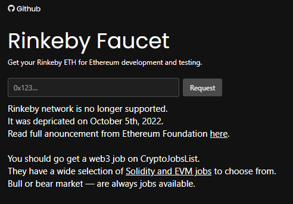
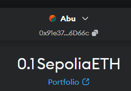
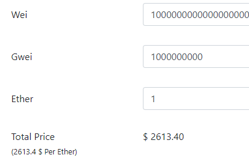
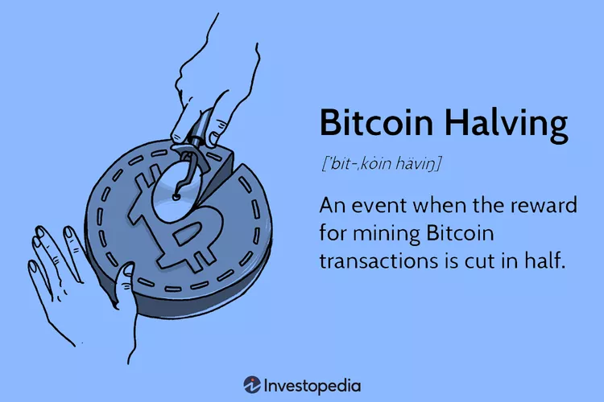
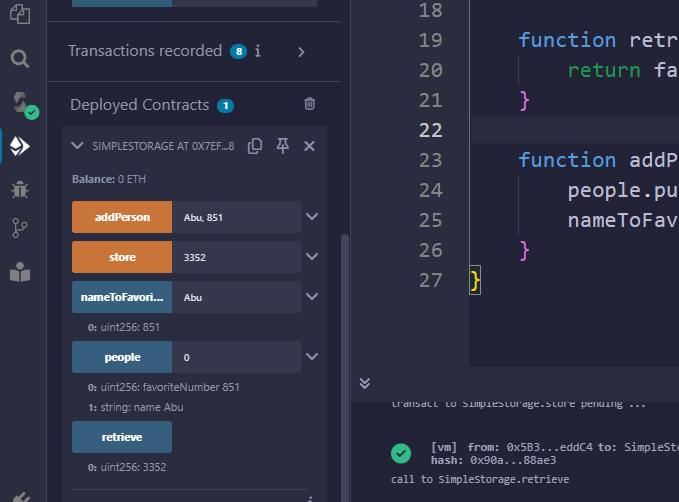
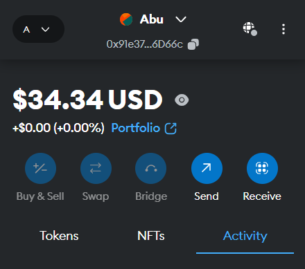

Diving into another interesting field within the realm of Computer Science. `Decentralized Finance`, is the future of currency at the rate it’s progressing and there’s much more to the technologies behind it that make it the way it is.

### Inception

`Blockchain` is the central ideology behind the whole concept of De-Fi. It holds a chain of all the transactions in the network, paving the way to the rise of Decentralized Finance.

`Bitcoin` is the first protocol/application that took Blockchain mainstream to the masses.

`Smart Contracts` are self executing sets of Instructions, which can be deployed to the Blockchain network without 3rd party involvement.

`Solidity` is the Programming Language with which a Smart Contract is written.

`Ethereum` is a protocol that is a subsidy of the Blockchain Technology, that is similar to Bitcoin, but with the addition of Smart Contracts.

`Blockchain Oracles` are external concepts that feed the Blockchain network with real-life data.

`Decentralized Applications [Dapp]` are the end product on a De-Fi network that user can interact.

`Chainlink` is a Decentralized Oracle Network that provides data and external computation to smart contracts and allows us to build Hybrid Smart Contracts.

`Hybrid Smart Contracts` are a combination of on-chain logic settlement layers and external off-chain components.

`DAOs [Decentralized Autonomous Organizations]` are organization, that is similar to a traditional organization but that does all it’s operations on-chain with matters like governance tokens for voting and so on.

`Mnemonic Keys` acts like a vault that can have multiple accounts. If one has the mnemonic keys then that user can access all the accounts on that vault.

`Testnets` are free and for testing Smart Contracts, whereas `Mainnets` cost money and are live.

`Faucets` is a platform that provides users with small quantities of cryptocurrency for testing out applications and for other purposes.

`Block` is a list of transactions mined together.

`Nonce` is the number used once to find the solution to the Blockchain problem.

`Block Explorers` used to view account, transaction and other details of the Blockchain.

`Gas` is a unit of computational measure, the more the computation a transaction uses the more gas the user has to pay the node operators [admins that maintain the entirety of Blockchain nodes], it has has it types like Gas Price[`GWEI`], Gas Limit, Gas used by Transactions and so on.

`Mining` is the process of finding the solution [`nonce`] to the Blockchain problem, nodes get paid for mining blocks.

`Node` is a single instance of a decentralized network.

One might wonder, why is this revolutionary? Blockchain is a revolutionary technology that has various strong ideologies behind it. Being Decentralized makes it so that, no single entity is able to control or manipulate a financial system and everyone can see every transaction that any user does, making it transparent, also using Blockchain improves speed and efficiency, let’s take a scenario, making a withdrawal from a Bank might take 3-5 days, whereas in Blockchain it can be instantaneous. Blockchain is also highly secured, additionally it being open to the public makes it so that, it can’t be tampered with making it Immutable, and cherry on the top is that even if multiple nodes in the Blockchain network goes down, it doesn’t matter as long as there’s a single node that’s running the network, it’s safe which can’t be said about the traditional banking system. Finally, the Blockchain allows for trustless or trust-minimized agreements, which is incredibly useful as they form the basis of agreement within parties, unlike the real-world with the other party could possibly find loopholes and try to exploit them, to which the user sues them or takes them to court, which is a huge loss of time and resources, for something the user should have gotten in the first place, but all this isn’t possible in a Blockchain period. The rules of Blockchain don’t change for anybody regardless of their age, religion, nationality or any other factor. 1 + 1 is always equals 2. Simple yet powerful.

Now, we try to create our first transaction on a Testnet. Sadly, the tutorial that I was following used the `Rinkeby Testnet` which was already deprecated. Let’s try to use another Testnet.



[Ropsten, Rinkeby & Kiln Deprecation Announcement | Ethereum Foundation Blog](https://blog.ethereum.org/2022/06/21/testnet-deprecation)


[Sepolia Faucet - Get Testnet Tokens](https://faucets.chain.link/sepolia)



As for estimating the amount of Gas to do a transaction on the mainnet, we use a gas estimator, that is kind off like a estimator in real time that estimates the amount of gas required to process a transaction based on traffic, as traffic on the Blockchain is directly proportional to the Gas rates, in case of higher traffic on the network, the more gas we pay to the node operators makes the it so that more importance is given to the transaction and the faster it gets deployed. Ethereum gas fees are determined by three variables: complexity, base fee, and priority fee.

One GWEI is equal to one-billionth of an Ether (ETH), the native cryptocurrency of the Ethereum blockchain. GWEI is the most commonly used unit of Ether for these purposes because it's a more practical unit for calculating costs. Wei is the smallest unit of Ether. There are 1 billion `WEI` in one GWEI.



[Blockchain 101 - A Visual Demo](https://youtu.be/_160oMzblY8?si=NrcIqBRNBr6i-Cef)

I assume that the user knows about public and private keys, and the whole signing/verifying authentications as it forms the basis on how a Blockchain functions, if not do read about them. Now we learn about a new term, `Consensus` which is the mechanism used to agree on the state of the blockchain. Under it comes Proof of Work [`PoW`] and Proof of Stake [`PoS`], basically it like a demonstration that shows the authenticity of how the blockchain with all of it independent nodes work. Now, roughly speaking the Consensus mechanism of a decentralized blockchain network is made of 2 types:

- `Chain Selection`
- `Sybil Resistance`

Now PoW is known as a Sybil Resistance mechanism as it defines a way to figure out the block author or the node that did the work to find the solution/transaction and it can authenticate the appropriate user. Now that we put this mechanism in place, no matter how many pseudonymous accounts that the attacker makes, it still has to go through this computationally expensive authentication mechanism to verify the account. 

[Sybil attack](https://en.wikipedia.org/wiki/Sybil_attack)

[How Malicious Tor Relays are Exploiting Users in 2020 (Part I)](https://nusenu.medium.com/how-malicious-tor-relays-are-exploiting-users-in-2020-part-i-1097575c0cac)

Both Bitcoin and Ethereum use a consensus called `Nakamoto Consensus` . 

Nakamoto Consensus is a combination of two key components:

- Proof of Work (PoW) as a Sybil resistance mechanism⁠⁠
- The longest chain rule for chain selection

This consensus mechanism was first introduced by Satoshi Nakamoto in the Bitcoin whitepaper, hence the name. It allows decentralized networks to agree on the state of the blockchain and prevent malicious actors from taking control of the network.

The Proof of Work aspect ensures that adding new blocks to the blockchain requires significant computational effort, making it difficult and expensive for attackers to manipulate the system⁠. The longest chain rule helps resolve conflicts when multiple valid chains exist, by considering the chain with the most accumulated work as the correct one. Here the computational effort, is in the form of `Block Confirmations` as it’s the number of a blocks added onto the network after a transaction occurs, so for example if the confirmation is 2 for a transaction, it means there are 2 blocks that are ahead of the current block, and the mechanism goes through the computation of verifying/mining into the other 2 blocks.

<aside>
💡

Proof of Work takes up a ton of computational energy.

</aside>

So when a transaction happens, someone has to go through the process of calculating the nonce/solution and update the entire blockchain network constantly, now these people(nodes) are competing against each other to find the solution for the blockchain riddle first, and the node to find the solution gets the reward, which is again 2 things, one is the transaction fees[`GWEI`] from the user and the other is the block reward, which originates from the blockchain itself.

[Bitcoin Halving: What It Is and Why It Matters for Crypto Investors](https://www.investopedia.com/bitcoin-halving-4843769)




Attacks on the bitcoin are doable but insanely difficult to carry out.

- Cybil Attack
- 51% Attack

as for the 51% attack, it can do so by forking the entire blockchain network if a single entity manages to control about 51% or more of the the nodes in the network. And it has happened in Ethereum Classic. Basically influencing the entire network.

[Ethereum Classic 51% Attacks](https://neptunemutual.com/blog/ethereum-classic-51-attacks/)

So all of the above involved Proof of Work [PoW], which is like a brutal competition in which the fastest node wins, and this computation uses up a lot of energy which isn’t environmentally friendly. And this is where Proof Of Stake [PoS] comes in. 

In contrast to PoW, Proof of Stake (PoS) is a consensus mechanism where validators are chosen to create new blocks based on the amount of cryptocurrency they hold and are willing to "stake" as collateral. This method significantly reduces energy consumption and allows for more scalability.

<aside>
💡

Proof of Stake nodes put up a collateral as a sybil resistance mechanism, these collateral act as stakes that the PoS nodes use it order to resist the mechanism, the stake actual Ethereum as collateral.

</aside>

Now, in this ETH 2.0, miners are essentially called `validators`, where here they aren’t actually mining for the solution, but just validating other nodes and transactions.

Several blockchain networks have adopted or are using PoS:

- Avalanche
- Solana
- Polygon

Ethereum, recognizing the benefits of PoS, has transitioned from PoW to PoS in a major upgrade known as "The Merge", which was completed in September 2022. This transition marked the beginning of Ethereum 2.0, also known as Eth2 or "`Serenity`". 

Key features of Eth2 include:

- **Reduced energy consumption:** PoS is estimated to use 99.95% less energy than PoW.
- **Improved scalability**
- **Enhanced security**

We also improve upon a scalability issue from ETH 1.0, where as the traffic grows on the blockchain, users had to pay more gas(GWEI) in order to make the transaction, in ETH 2.0, we bring in a concept called `Sharding` , which abstractly means blockchains upon blockchains, so the idea here is to hold a main blockchain that expands and builds into multiple smaller blockchains, and this results in a increase in transactions with much cheaper gas prices and can be easily scaled.

In the context of blockchain technology, there are typically two main layers discussed:

1. Layer 1 (Base Layer): This refers to the foundational blockchain implementations.
- `Bitcoin`
- `Ethereum`
- `Avalanche`

Layer 1 blockchains are the primary networks that handle the consensus mechanisms, security, and transaction processing directly on the blockchain.

1. Layer 2 (Second Layer): These are implementations built on top of Layer 1 blockchains. Layer 2 solutions aim to improve scalability and efficiency of the base layer.
- `Chainlink`
- `Arbitrum`

Layer 2 solutions often handle transactions off-chain and then settle them on the main blockchain, reducing congestion and potentially lowering transaction costs.

These layers work together to create a more scalable and efficient blockchain ecosystem, with Layer 1 providing the core functionality and security, while Layer 2 solutions enhance performance and usability.

### Solidity

Let’s dive into Remix. Remix is a browser-based compiler and IDE that enables users to build Ethereum contracts with Solidity language and to debug transactions.

[Remix - Ethereum IDE](https://remix.ethereum.org/)

Under the files explorer, we can find the relevant files for the project. Here we can create `.sol` files to program in Solidity and deploy and do whatever to the Ethereum blockchain.

<aside>
💡

Solidity is a statically-typed curly-braces programming language designed for developing smart contracts that run on Ethereum.

</aside>

[Solidity — Solidity 0.8.28 documentation](https://docs.soliditylang.org/en/stable/)


```bash
// SPDX-License-Identifier: MIT
pragma solidity ^0.8.0;

contract HelloWorld {
    function helloWorld() external pure returns (string memory) {
        return "Hello World !";
    }
}
```



Here’s a sample program in Solidity to practice and deploy all within the Remix testing environment.

```bash
// SPDX-License-Identifier: MIT
pragma solidity ^0.8.0;

contract SimpleStorage {
    uint256 favoriteNumber;

    struct People {
        uint256 favoriteNumber;
        string name;
    }

    People[] public people;
    mapping(string => uint256) public nameToFavoriteNumber;

    function store(uint256 _favoriteNumber) public {
        favoriteNumber = _favoriteNumber;
    }

    function retrieve() public view returns(uint256) {
        return favoriteNumber;
    }

    function addPerson(string memory _name, uint256 _favoriteNumber) public {
        people.push(People(_favoriteNumber,_name));
        nameToFavoriteNumber[_name] = _favoriteNumber;
    }
}
```

Now, let’s install `Foundry`.

<aside>
💡

Foundry is a smart contract development toolchain. Foundry manages your dependencies, compiles your project, runs tests, deploys, and lets you interact with the chain from the command-line and via Solidity scripts.

</aside>

```bash
┌──(abu㉿Abuntu)-[~]
└─$ curl -L https://foundry.paradigm.xyz | bash
  % Total    % Received % Xferd  Average Speed   Time    Time     Time  Current
                                 Dload  Upload   Total   Spent    Left  Speed
100   167  100   167    0     0    547      0 --:--:-- --:--:-- --:--:--   551
100  2189  100  2189    0     0   3413      0 --:--:-- --:--:-- --:--:--     0
Installing foundryup...

Detected your preferred shell is bash and added foundryup to PATH.
Run 'source /home/abu/.bashrc' or start a new terminal session to use foundryup.
Then, simply run 'foundryup' to install Foundry.

┌──(abu㉿Abuntu)-[~]
└─$ source /home/abu/.bashrc

┌──(abu㉿Abuntu)-[~]
└─$ foundryup

.xOx.xOx.xOx.xOx.xOx.xOx.xOx.xOx.xOx.xOx.xOx.xOx.xOx.xOx.xOx.xOx.xOx.xOx

 ╔═╗ ╔═╗ ╦ ╦ ╔╗╔ ╔╦╗ ╦═╗ ╦ ╦         Portable and modular toolkit
 ╠╣  ║ ║ ║ ║ ║║║  ║║ ╠╦╝ ╚╦╝    for Ethereum Application Development
 ╚   ╚═╝ ╚═╝ ╝╚╝ ═╩╝ ╩╚═  ╩                 written in Rust.

.xOx.xOx.xOx.xOx.xOx.xOx.xOx.xOx.xOx.xOx.xOx.xOx.xOx.xOx.xOx.xOx.xOx.xOx

Repo       : https://github.com/foundry-rs/
Book       : https://book.getfoundry.sh/
Chat       : https://t.me/foundry_rs/
Support    : https://t.me/foundry_support/
Contribute : https://github.com/orgs/foundry-rs/projects/2/

.xOx.xOx.xOx.xOx.xOx.xOx.xOx.xOx.xOx.xOx.xOx.xOx.xOx.xOx.xOx.xOx.xOx.xOx

foundryup: installing foundry (version nightly, tag nightly)
foundryup: downloading latest forge, cast, anvil, and chisel
######################################################################################################################## 100.0%
foundryup: downloading manpages
######################################################################################################################## 100.0%
foundryup: installed - forge 0.2.0 (d2ed15d 2024-11-04T00:23:16.090720498Z)
foundryup: installed - cast 0.2.0 (d2ed15d 2024-11-04T00:23:14.959250897Z)
foundryup: installed - anvil 0.2.0 (d2ed15d 2024-11-04T00:23:16.107912651Z)
foundryup: installed - chisel 0.2.0 (d2ed15d 2024-11-04T00:23:16.047706411Z)
foundryup: done!
```

So usually in CTF challenges, we are given a private chain to connect to and we’re provided with all the requirements like wallets, test tokens and all that, we need to write solidity code and compile or deploy it with `forge` to solve the challenge. `forge` is a CLI tool to build, test, fuzz, debug and deploy Solidity contracts.

Came across this during the `GlacierCTF 2024`.

[HTB Business CTF 2024 - Recruitment [blockchain]](https://wepfen.github.io/writeups/recruitment/#getting-familiar-with-the-instance)

Here’s a video (with a robotic voice due to the echo LOL) that gives a brief introduction to approaching blockchain challenges.

[Video](https://drive.google.com/file/d/1jLqEPv-6UEewLny98ZwIOVOO94S8jsza/view)

Also here’s a still from `Metamask` for the `Avalanche Fuji Testnet`. I’m Rich LOL.



In order to get Testnet tokens, use a faucet like this.

[Chainlink Faucets - Get Testnet Tokens](https://faucets.chain.link/)

For some reason this doesn’t seem to work anymore. And if you’re kind enough to send some Mainnet tokens, here’s my contract address:  `0x91e3749337be7b61afa2ddeeccbbb4e030d6d66c` HAHA.

### Resources

[Solidity, Blockchain, and Smart Contract Course – Beginner to Expert Python Tutorial](https://youtu.be/M576WGiDBdQ?si=AAIIiG5XBfUSq4ia)

[Solidity — Solidity 0.8.28 documentation](https://docs.soliditylang.org/en/stable/)

[ethereum/solidity](https://github.com/ethereum/solidity)

[Foundry Book](https://book.getfoundry.sh/)

[Learn Crypto – The Best Crypto Course on the Internet](https://teachyourselfcrypto.com/)

[ethereumbook/ethereumbook](https://github.com/ethereumbook/ethereumbook)

[bellaj/Blockchain](https://github.com/bellaj/Blockchain)

[minaminao/ctf-blockchain](https://github.com/minaminao/ctf-blockchain)
