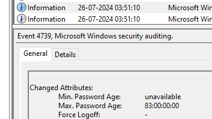
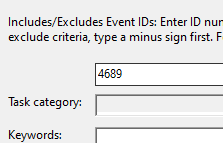
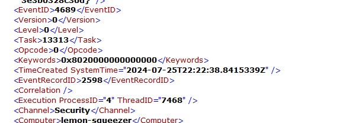
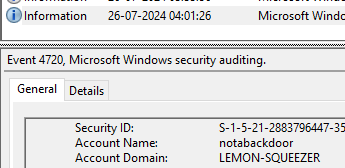

Hello again, let’s play corCTF 2024!

## Forensics

### **the-conspiracy**

Description: Our intelligence team created a chat app, and secretly distributed it to the lemonthinker gang. We've given you the application source and a capture taken by one of our agents - can you uncover their plans?

Author: `jammy`

Given: `challenge.pcap` & `source.py`

Well, looking at the source code first, we see it’s a script that shows how the messages were encrypted and sent over the network.

```bash
import random
from scapy.all import *
import csv

sources, destinations, messages = [], [], []

with open('chatlogs.csv', mode='r') as file:
    csv_reader = csv.reader(file)
    for row in csv_reader:
        sources.append(row[0])
        destinations.append(row[1])
        messages.append(row[2])

def encrypt(message):
    messagenums = []
    for character in message:
        messagenums.append(ord(character))
    keys = []
    for i in range(len(messagenums)):
        keys.append(random.randint(10, 100))

    finalmessage = []
    for i in range(len(messagenums)):
        finalmessage.append(messagenums[i] * keys[i])

    return keys, finalmessage

for i in range(len(messages)):
    finalmessage, keys = encrypt(messages[i])
    print(finalmessage, keys)
    packet1 = IP(src=sources[i], dst=destinations[i])/TCP(dport=80)/Raw(load=str(finalmessage))
    send(packet1)
    packet2 = IP(src=sources[i], dst=destinations[i])/TCP(dport=80)/Raw(load=str(keys))
    send(packet2)
```

- **Reading Messages:** The script reads messages from a CSV file (`chatlogs.csv`), storing sources, destinations, and messages.
- **Encryption:** Each message is encrypted by:
    - Converting each character to its ASCII value.
    - Generating a random key for each character (a number between 10 and 100).
    - Multiplying each ASCII value by its corresponding key to create an encrypted message.
- **Sending Packets:** Two packets are sent for each message:
    - The first packet contains the encrypted message.
    - The second packet contains the keys used for encryption.

Here’s the OG doing all the explanations.

The solution script reads the PCAP file, extracts the encrypted messages and keys, and decrypts them.

`Step-by-Step Explanation`

1. **Importing Libraries:**
    
    ```python
    pythonCopy code
    from scapy.all import *
    import ast
    
    ```
    
2. **Loading the PCAP File:**
    
    ```python
    pythonCopy code
    packets = rdpcap('challenge.pcap')
    
    ```
    
    This reads all the packets from the PCAP file into a list called `packets`.
    
3. **Initializing Lists to Store Data:**
    
    ```python
    pythonCopy code
    encrypted_messages = []
    keys = []
    
    ```
    
    These lists will store the extracted encrypted messages and keys.
    
4. **Extracting Packets:**
    
    ```python
    pythonCopy code
    for packet in packets:
        if Raw in packet:
            data = packet[Raw].load
            try:
                data_list = ast.literal_eval(data.decode(errors='ignore'))
                if all(isinstance(x, int) for x in data_list):
                    if len(encrypted_messages) == len(keys):
                        encrypted_messages.append(data_list)
                    else:
                        keys.append(data_list)
            except (ValueError, SyntaxError):
                continue
    
    ```
    
    - **Checking for Raw Data:** It checks if the packet contains raw data (`Raw` layer).
    - **Decoding Data:** It attempts to decode the raw data, ignoring any errors.
    - **Parsing Data:** Uses `ast.literal_eval` to safely evaluate the data as a Python literal. This is because the data is expected to be a list of integers.
    - **Storing Data:** Depending on whether `encrypted_messages` and `keys` have the same length, it decides whether the data is an encrypted message or keys.
5. **Decrypting the Messages:**
    
    ```python
    pythonCopy code
    decrypted_messages = []
    for enc_msg, key in zip(encrypted_messages, keys):
        decrypted_msg = ''.join(chr(enc_msg[i] // key[i]) for i in range(len(enc_msg)))
        decrypted_messages.append(decrypted_msg)
    
    ```
    
    - **Iterating through Messages and Keys:** Pairs each encrypted message with its corresponding keys.
    - **Decrypting:** Divides each element of the encrypted message by its corresponding key to retrieve the ASCII value of the original characters. Converts these ASCII values back to characters to form the decrypted message.
    - **Storing Decrypted Messages:** Appends the decrypted message to the `decrypted_messages` list.
6. **Outputting Decrypted Messages:**
    
    ```python
    pythonCopy code
    for msg in decrypted_messages:
        print(msg)
    
    ```
    
    - **Printing Messages:** Prints each decrypted message to the console.

```bash
└─$ python3 solve.py
hello blinkoid
hello night
how do we eliminate the msfroggers
idk i'll ask slice1
how do we eliminate the msfroggers
we can send them to the skibidi toilet
or we can deprive them of their fanum tax
slice1 is being useless
what's new
blinkoid? message back :(
oh errr... this sounds great! any more ideas
we could co-conspire with the afs
and get them to infiltrate the msfroggers
that way team lemonthink reins supreme
your a genius!
alright night
i have my own idea
let's hear it
so yk about the afs
if we send our secret code over to them
they can use it to infiltrate the afs
what's our code again?
i think it's corctf{b@53d_af_f0r_th3_w1n}
hey night did you hear my idea
you had an idea? blinkoid just told me you were being useless
what the sigma
```

Flag: `corctf{b@53d_af_f0r_th3_w1n}`

### **infiltration**

Description: 

After successfully infiltrating the lemonthinker gang, we've obtained their current location - the UK. We've attained some security logs from a gang member's PC, but need some help in answering information relating to these.

`nc be.ax 32222`

Given: `security-logs.evtx`

First 2 questions can be solved pretty easily.

```python
└─$ nc be.ax 32222
Hello agent. Thanks for your hard work in the field researching. We'll now ask you 6 questions on the information you've gathered.
I'd like to take this opportunity to remind you that our targets are located in the United Kingdom, so their timezone is BST (UTC +1).
We'd like to confirm what the username of the main user on the target's computer is. Can you provide this information? slice1
Correct! Excellent work.
Now, we'd like the name of the computer, after it was renamed. Ensure that it is entered in exactly how it is in the logs. lemon-squeezer
Correct! Excellent work.
```

`slice1`  & `lemon-squeezer`. Third was, 

I wonder if they'll make any lemonade with that lemon-squeezer...
Great work! In order to prevent their lemons from moulding, the lemonthinkers changed the maximum password age. What is this value? Please enter it as an integer number in days.

Searching for “Password Age”, we fall upon this event that gives it out.



Also, event `4689` gives the list of all process termination events. Let’s use it to filter the file.



After filtering, we get a list of 140 events, much better than 5000 events clobbered together. Now, let’s search for processes that with .`exe’s` that are related to the Windows Anti-Virus or something.

Here are some of the processes I found SUS.

`WMIADAP.exe
WmiPrvSE.exe
SecurityHealthHost.exe
MpCmdRun.exe
NisSrv.exe`

But the one that stood out the most was `NisSrv.exe`. The Microsoft Network Real-Time Inspection Service" process (also known as NisSrv.exe) is part of Microsoft's antivirus software. This service is always running in the background of your PC, **monitoring and inspecting network traffic in real time**.



Now, you just had to convert the `TimeCreated SystemTime` to a UNIX timestamp.

```python
from datetime import datetime
import pytz

timestamp_str = '2024-07-25T22:22:38.8415339Z'

if len(timestamp_str) > 23:
    timestamp_str = timestamp_str[:23] + 'Z'

timestamp = datetime.strptime(timestamp_str, '%Y-%m-%dT%H:%M:%S.%f%z')

unix_timestamp = int(timestamp.timestamp())

print(f"UNIX Timestamp: {unix_timestamp}")
```

Unix Timestamp: `1721946158`

or just use a online UNIX convertor.

[Epoch Converter](https://www.epochconverter.com/)

The next question was to find the user that was created by the malware. 
When a new user is created on a Windows system, the Event Logger records this activity in the Security log. Specifically, the event is recorded with the Event ID `4720` (for user account creation). This event provides details about the creation of a new user account, including the username, the domain, and the user who created the account.
Therefore, after applying the filter, I got 3 events from which one of them was `notabackdoor`



After, playing around with the file a bit more. I focused on these groups.

- **Event ID 4728**: A user was added to a global group.
- **Event ID 4729**: A user was removed from a global group.
- **Event ID 4732**: A user was added to a local group.
- **Event ID 4733**: A user was removed from a local group.

Tried, `Administrators` and it worked !

Final response: Thank you for your hard work in the field. We'll be in touch with your next mission soon.
In the meantime, enjoy a flag!

Flag: `corctf{alw4y5_l3m0n_7h1nk_b3f0r3_y0u_c0mm1t_cr1m3}`
