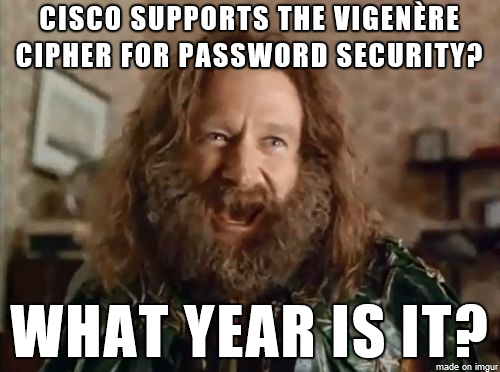
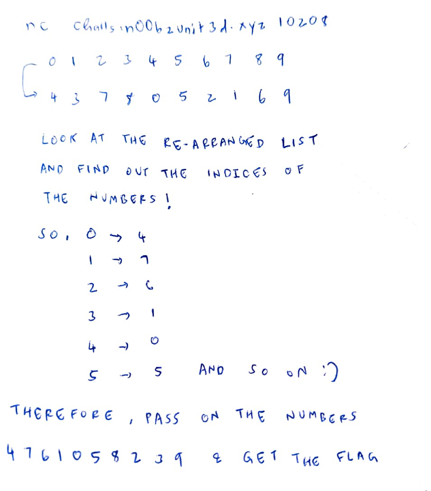
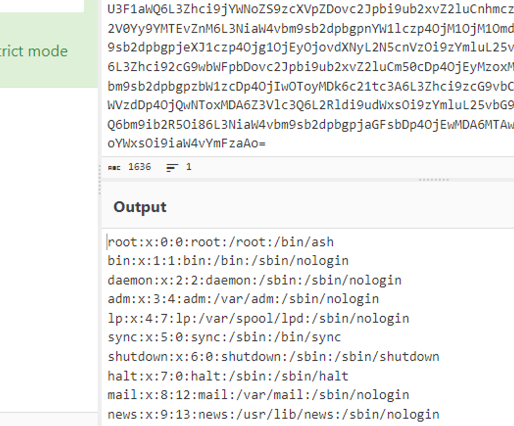
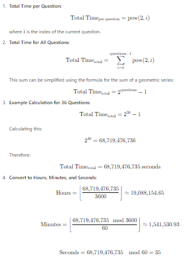
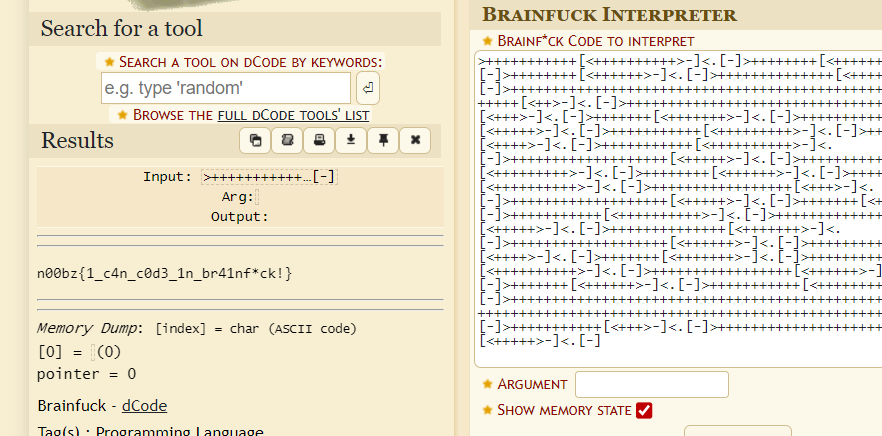

<script type="text/javascript" src="https://cdn.mathjax.org/mathjax/latest/MathJax.js?config=TeX-AMS-MML_HTMLorMML"></script>


Well, this was a blessing in disguise as it was made made for n00bz by n00bz.

```bash
Authors: AbuCTF, MrRobot, SHL, PattuSai
```

## Cryptography

### RSA

The cryptography category is incomplete without RSA. So here is a simple RSA challenge. Have fun! Author: `noob_abhinav`

**Attachments**

- [encryption.txt](https://static.n00bzunit3d.xyz/Crypto/RSA/encryption.txt)

Ah, the OG RSA challenge. 

```bash
e = 3
n = 135112325288715136727832177735512070625083219670480717841817583343851445454356579794543601926517886432778754079508684454122465776544049537510760149616899986522216930847357907483054348419798542025184280105958211364798924985051999921354369017984140216806642244876998054533895072842602131552047667500910960834243
c = 13037717184940851534440408074902031173938827302834506159512256813794613267487160058287930781080450199371859916605839773796744179698270340378901298046506802163106509143441799583051647999737073025726173300915916758770511497524353491642840238968166849681827669150543335788616727518429916536945395813
```

This is a straight forward challenge, of course you can take these values and paste it in any RSA decoders like `dcode` or `RsaCtfTool` and it would work. But let’s study the theory behind the reason that we’re able to crack the cipher. 

> Don’t Rush The Process, Trust The Process.
> 

Here’s an example with the `RsaCtfTool`.

```bash
└─$ python3 RsaCtfTool.py -n 135112325288715136727832177735512070625083219670480717841817583343851445454356579794543601926517886432778754079508684454122465776544049537510760149616899986522216930847357907483054348419798542025184280105958211364798924985051999921354369017984140216806642244876998054533895072842602131552047667500910960834243 
-e 3 --decrypt 13037717184940851534440408074902031173938827302834506159512256813794613267487160058287930781080450199371859916605839773796744179698270340378901298046506802163106509143441799583051647999737073025726173300915916758770511497524353491642840238968166849681827669150543335788616727518429916536945395813

Decrypted data :
HEX : 0x6e3030627a7b6372797074305f31735f316e63306d706c3374335f773174683075745f72733421217d
INT (big endian) : 235360648501923597413504426673122110620436456645077837051697081536135487875222175025616363200782717
INT (little endian) : 267274803801739728615674650006248742190143184448285803664400617962080516309180649444183969553723502
utf-8 : n00bz{crypt0_1s_1nc0mpl3t3_w1th0ut_rs4!!}
STR : b'n00bz{crypt0_1s_1nc0mpl3t3_w1th0ut_rs4!!}'
```

Note: I deep dive into theoretical mathematics and cryptography. If you good, skip to the next challenge.

Okay, this challenge involves the vulnerability in the exponent being a small number. We call this the *small public exponent attack*.

In RSA encryption, the security comes from the difficulty of reversing the encryption process without the private key. The process is based on modular arithmetic, where a message m is raised to the power of an exponent e and then reduced modulo n. The encryption formula is:

$$
c=m^emodn
$$

Here, c is the ciphertext, e is the public exponent, and n is the modulus, which is a product of two large prime numbers.

When e is small, like e = 3 , and the message m is also small, something unusual can happen.

This is because, In typical RSA encryption, m^e should be much larger than n, so that the operation m^emodn effectively "`wraps around`" [I’ll come back on what wraps around really means] and gives a number within the range of 0 to n -1. This wrapping ensures that the original message $m$ cannot be easily derived from the ciphertext c.

However, if the message m is small, then m^e might still be smaller than . For example, if m is small and e =3, then:

$$
m^3 < n
$$

In this case, the operation m^3 modn does nothing because m^e is already smaller than n. Therefore, the ciphertext c will just be m^e without any reduction. So, we can write:

$$
c = m^3
$$

So if an attacker intercepts this ciphertext c , they can easily recover the original message m by taking the cube root of c :

$$
m = \sqrt[3]{c}
$$

This works because the ciphertext is just m^e, and taking the cube root of m^e gives back m. No special mathematical tricks or complex calculations are needed—just a simple cube root operation.

<aside>
💡 The term "wraps around" refers to how modular arithmetic works. When we compute m^emodn, we are essentially reducing the number m^e to fit within the range from 0 to n -1.

</aside>

But funnily, there is a unique case for this, even thought what happens when m^e equals to n, I’ll leave this as an exercise for the reader to think about LOL.


`Exploit Time`

```python
import gmpy2

e = 3
n = 135112325288715136727832177735512070625083219670480717841817583343851445454356579794543601926517886432778754079508684454122465776544049537510760149616899986522216930847357907483054348419798542025184280105958211364798924985051999921354369017984140216806642244876998054533895072842602131552047667500910960834243
c = 13037717184940851534440408074902031173938827302834506159512256813794613267487160058287930781080450199371859916605839773796744179698270340378901298046506802163106509143441799583051647999737073025726173300915916758770511497524353491642840238968166849681827669150543335788616727518429916536945395813

m = gmpy2.iroot(c, e)[0]
mInt = int(m)

mBytes = mInt.to_bytes((mInt.bit_length() + 7) // 8, byteorder='big')
flag = mBytes.decode('utf-8')

print("Flag:", flag)
```

Output:

```python
└─$ python3 solve.py
Flag: n00bz{crypt0_1s_1nc0mpl3t3_w1th0ut_rs4!!}
```

Flag: `n00bz{crypt0_1s_1nc0mpl3t3_w1th0ut_rs4!!}`

### **Vinegar**

Can you decode this message? Note: Wrap the decrypted text in n00bz{}. Author: `noob_abhinav`

**Attachments**

- [enc.txt](https://static.n00bzunit3d.xyz/Crypto/Vinegar/enc.txt)

```python
Encrypted flag: nmivrxbiaatjvvbcjsf
Key: secretkey
```

We’ve been given the ciphertext and key, and this totally points to **`Vigenere` Cipher.**



Head on to `dCode` to decode it.


Flag: `n00bz{vigenerecipherisfun}`

### **Vinegar 2**

Never limit yourself to only alphabets! Author: `NoobMaster`

**Attachments**

- [chall.py](https://static.n00bzunit3d.xyz/Crypto/Vinegar2/chall.py)
- [enc.txt](https://static.n00bzunit3d.xyz/Crypto/Vinegar2/enc.txt)

```python
alphanumerical = 'abcdefghijklmnopqrstuvwxyzABCDEFGHIJKLMNOPQRSTUVWXYZ1234567890!@#$%^&*(){}_?'
matrix = []
for i in alphanumerical:
        matrix.append([i])

idx=0
for i in alphanumerical:
        matrix[idx][0] = (alphanumerical[idx:len(alphanumerical)]+alphanumerical[0:idx])
        idx += 1

flag=open('../src/flag.txt').read().strip()
key='5up3r_s3cr3t_k3y_f0r_1337h4x0rs_r1gh7?'
assert len(key)==len(flag)
flag_arr = []
key_arr = []
enc_arr=[]
for y in flag:
        for i in range(len(alphanumerical)):
                if matrix[i][0][0]==y:
                        flag_arr.append(i)

for y in key:
        for i in range(len(alphanumerical)):
                if matrix[i][0][0]==y:
                        key_arr.append(i)

for i in range(len(flag)):
        enc_arr.append(matrix[flag_arr[i]][0][key_arr[i]])
encrypted=''.join(enc_arr)
f = open('enc.txt','w')
f.write(encrypted)
```

```python
└─$ cat enc.txt
*fa4Q(}$ryHGswGPYhOC{C{1)&_vOpHpc2r0({
```

So, we’ve been given an another implementation of the **`Vigenere` Cipher.** But this time around `dCode` or `CyberChef` won’t be able to decode it since we have a much larger character set and hence the matrix is alphanumeric  when compared to the traditional alphabetic matrices that `dCode` uses. 

Another thing to note is that the key is the same length of the ciphertext and it includes special characters and all of that.

Key:      `5up3r_s3cr3t_k3y_f0r_1337h4x0rs_r1gh7?`

Cipher: `*fa4Q(}$ryHGswGPYhOC{C{1)&_vOpHpc2r0({`

- For each character in the flag and key, the code finds the index of that character in the `alphanumerical` string. This index is stored in `flag_arr` and `key_arr`.
- **Encryption:**
    - The encryption is performed by iterating over each character in the flag and key simultaneously. For each character in the flag, the code finds the corresponding row in the matrix using `flag_arr` (the index of the flag character).
    - Then, it uses the corresponding index from `key_arr` to find the character in that row, which becomes part of the encrypted message.
    - The resulting encrypted message is stored in `enc.txt`.

Now, we write a script that reverses the encryption by using the key to map the encrypted characters back to the original characters in the flag.

```python
alphanumerical = 'abcdefghijklmnopqrstuvwxyzABCDEFGHIJKLMNOPQRSTUVWXYZ1234567890!@#$%^&*(){}_?'
matrix = []

for i in alphanumerical:
    matrix.append([i])

for idx, i in enumerate(alphanumerical):
    matrix[idx][0] = (alphanumerical[idx:] + alphanumerical[:idx])

cipher = '*fa4Q(}$ryHGswGPYhOC{C{1)&_vOpHpc2r0({'
key = '5up3r_s3cr3t_k3y_f0r_1337h4x0rs_r1gh7?'

keyIndices = []
for y in key:
    for i in range(len(alphanumerical)):
        if matrix[i][0][0] == y:
            keyIndices.append(i)

decrypted = []
for i, encChar in enumerate(cipher):
    keyIDX = keyIndices[i]
    for j, char in enumerate(matrix[keyIDX][0]):
        if char == encChar:
            decrypted.append(alphanumerical[j])
            break

flag = ''.join(decrypted)
print(flag)
```

Flag: `n00bz{4lph4num3r1c4l_1s_n0t_4_pr0bl3m}`

### Random

I hid my password behind an impressive sorting machine. The machine is very luck based, or **is it**?!?!?!? Author: Connor Chang

**Attachments:**

- [server.cpp](https://static.n00bzunit3d.xyz/Crypto/Random/server.cpp)

```cpp
#include<chrono>
#include<cstdlib>
#include<iostream>
#include<algorithm>
#include<string>
#include<fstream>
#include<thread>
#include<map>
using namespace std;

bool amazingcustomsortingalgorithm(string s) {
    int n = s.size();
    for (int i = 0; i < 69; i++) {
        cout << s << endl;
        bool good = true;
        for (int i = 0; i < n - 1; i++)
            good &= s[i] <= s[i + 1];

        if (good)
            return true;

        random_shuffle(s.begin(), s.end());

        this_thread::sleep_for(chrono::milliseconds(500));
    }

    return false;
}

int main() {
    string s;
    getline(cin, s);

    map<char, int> counts;
    for (char c : s) {
        if (counts[c]) {
            cout << "no repeating letters allowed passed this machine" << endl;
            return 1;
        }
        counts[c]++;
    }

    if (s.size() < 10) {
        cout << "this machine will only process worthy strings" << endl;
        return 1;
    }

    if (s.size() == 69) {
        cout << "a very worthy string" << endl;
        cout << "i'll give you a clue'" << endl;
        cout << "just because something says it's random mean it actually is" << endl;
        return 69;
    }

    random_shuffle(s.begin(), s.end());

    if (amazingcustomsortingalgorithm(s)) {
        ifstream fin("flag.txt");
        string flag;
        fin >> flag;
        cout << flag << endl;
    }
    else {
        cout << "UNWORTHY USER DETECTED" << endl;
    }
}
```



```cpp
└─$ nc challs.n00bzunit3d.xyz 10208
4761058239
0123456789
n00bz{5up3r_dup3r_ultr4_54f3_p455w0rd_1fa89f63a437}
```

Flag: `n00bz{5up3r_dup3r_ultr4_54f3_p455w0rd_1fa89f63a437}`

## Web

### **Passwordless**

Tired of storing passwords? No worries! This super secure website is passwordless! Author: `NoobMaster`

**Attachments**

- [app.py](https://static.n00bzunit3d.xyz/Web/Passwordless/app.py)
- https://24.199.110.35:40150/

```python
#!/usr/bin/env python3
from flask import Flask, request, redirect, render_template, render_template_string
import subprocess
import urllib
import uuid
global leet

app = Flask(__name__)
flag = open('/flag.txt').read()
leet=uuid.UUID('13371337-1337-1337-1337-133713371337')

@app.route('/',methods=['GET','POST'])
def main():
    global username
    if request.method == 'GET':
        return render_template('index.html')
    elif request.method == 'POST':
        username = request.values['username']
        if username == 'admin123':
            return 'Stop trying to act like you are the admin!'
        uid = uuid.uuid5(leet,username) # super secure!
        return redirect(f'/{uid}')

@app.route('/<uid>')
def user_page(uid):
    if uid != str(uuid.uuid5(leet,'admin123')):
        return f'Welcome! No flag for you :('
    else:
        return flag

if __name__ == '__main__':
    app.run(host='0.0.0.0', port=1337)
```


Just a simple website that took in the username `admin123` and password to log the user in.

```python
if username == 'admin123':
            return 'Stop trying to act like you are the admin!'
        uid = uuid.uuid5(leet,username) # super secure!
        return redirect(f'/{uid}')
```

In this part of the flask code, you see that the server accepts the username `admin123` and returns the strings “Stop trying to act like you are the admin!” and for other usernames then there is a page route that redirects to `/{uid}` .


<aside>
💡 The vulnerability lies in the use of UUID version 5 (`uuid.uuid5`). UUID version 5 generates a UUID based on a namespace (`leet` in this case) and a name (`username`). Since both the namespace and the target name (`'admin123'`) are known, an attacker can calculate the correct UUID corresponding to `'admin123'`.

</aside>

Here is a simple script that calculate the UUID of the admin123 user.

```python
import uuid

leet = uuid.UUID('13371337-1337-1337-1337-133713371337')
target = 'admin123'

UUID = uuid.uuid5(leet, target)
print(UUID)
```

```python
└─$ python3 generate.py
3c68e6cc-15a7-59d4-823c-e7563bbb326c
```

Now, paste this UUID in the URL and get the flag.


Flag: `n00bz{1337-13371337-1337-133713371337-1337}`

### **Focus on yourSELF**

Have you focused on yourself recently? Author: `NoobHacker`

**Attachments**

- [docker-compose.yaml](https://static.n00bzunit3d.xyz/Web/Focus-on-yourSELF/docker-compose.yaml)

So, first of all I’m not a web guy, but I gave it a try anyways.

```python
└─$ cat docker-compose.yaml
# CHANGE THE FLAG WHEN HANDING THIS OUT TO PLAYERS

services:
  web:
    build: .
    ports:
      - "4000:1337"
    environment:
      - FLAG="n00bz{f4k3_fl4g_f0r_t3st1ng}"
```

We were also given a web instance, 

**Instance Info**

[Link to the Challenge](https://7a084670-35e8-406a-9247-06707fcf46d5.challs.n00bzunit3d.xyz:8080/)

You see the SELF capitalized in the title of the challenge, that and the flag in the environment in the `docker-compose.yaml` file lead me to conclude that the flag is located in the environment of the site.

A quick google on where the environment variables get stores, gives me `/proc/self/environ`. This also means the site is vulnerable to `LFI [Local File Inclusion]` . Let’s check if it’s actually vulnerable to LFI.

Going to the `view` page, we see an image with the URL, 

[Image](https://7a084670-35e8-406a-9247-06707fcf46d5.challs.n00bzunit3d.xyz:8080/view?image=nature.jpeg)

so instead of `/view?image=nature.jpeg` let’s do `/view?image=../../../../etc/passwd` .

It didn’t print out the detail then and there, going to the source.


We see a huge `base64` string. 



Turns out it actually is the `etc/passwd` file. Crazy. Now let’s find out the environment variables.

`/view?image=../../../../proc/self/environ` and decoding the base64, we get the flag.

```python
PATH=/usr/local/bin:/usr/local/sbin:/usr/local/bin:/usr/sbin:/usr/bin:/sbin:/bin␀
HOSTNAME=bed1b2061841␀FLAG=n00bz{Th3_3nv1r0nm3nt_det3rmine5_4h3_S3lF_d542cc29d35c}
␀LANG=C.UTF-8␀GPG_KEY=A035C8C19219BA821ECEA86B64E628F8D684696D␀
PYTHON_VERSION=3.10.14␀PYTHON_PIP_VERSION=23.0.1␀PYTHON_SETUPTOOLS_VERSION=65.5.1␀
PYTHON_GET_PIP_URL=https://github.com/pypa/get-pip/raw/66d8a0f637083e2c3ddffc0cb1e65ce126afb856/public/get-pip.py␀PYTHON_GET_PIP_SHA256=6fb7b781206356f45ad79efbb19322caa6c2a5ad39092d0d44d0fec94117e118␀HOME=/home/chall␀
```

Flag: `n00bz{Th3_3nv1r0nm3nt_det3rmine5_4h3_S3lF_d542cc29d35c}`

## Misc

### **Sanity Check**

Welcome to n00bzCTF 2024! Join our [discord](https://discord.gg/Kze7sjpgf7) server to get the flag! Author: `n00bzUnit3d`

Join discord and scroll into #Announcements.

Flag: `n00bz{w3lc0m3_t0_n00bzCTF2024!}`

### **Addition**

My little brother is learning math, can you show him how to do some addition problems? Author: Connor Chang

**Attachments**

- [server.py](https://static.n00bzunit3d.xyz/Misc/Addition/server.py)
- nc 24.199.110.35 42189

```python
import time
import random

questions = int(input("how many questions do you want to answer? "))

for i in range(questions):
    a = random.randint(0, 10)
    b = random.randint(0, 10)

    yourans = int(input("what is " + str(a) + ' + ' + str(b) + ' = '))

    print("calculating")

    totaltime = pow(2, i)

    print('.')
    time.sleep(totaltime / 3)
    print('.')
    time.sleep(totaltime / 3)
    print('.')
    time.sleep(totaltime / 3)

    if yourans != a + b:
        print("You made my little brother cry 😭")
        exit(69)

f = open('/flag.txt', 'r')
flag = f.read()
print(flag[:questions])
```

In the server code, it does additions and checks the answer, but `sighs`

To determine how long it would take for the entire script to run, let's break it down step-by-step:



<aside>
💡 It would take approximately, 2.2 million years to complete all questions !

</aside>

But start playing around with it, try inputting different numbers in the instance, remember there’s not just positive numbers in the world. Once you figure it out. Flag!

- **Negative or Zero Questions**:
    - If you enter `1` or `0`, the `range(questions)` loop won’t execute any iterations. This is because `range(-1)` and `range(0)` result in an empty sequence. As a result, no questions are processed, and no delays are introduced.
- **Immediate Access to the Flag**:
    - Since no questions are processed, the code immediately proceeds to open the `/flag.txt` file and print the flag.
    - In the specific case of `1`, the loop effectively does nothing, and the script directly accesses the flag file.


Truly a big-brain moment LOL.

```python
└─$ nc 24.199.110.35 42189
how many questions do you want to answer? -1
n00bz{m4th_15nt_4ll_4b0ut_3qu4t10n5}
```

Flag: `n00bz{m4th_15nt_4ll_4b0ut_3qu4t10n5}`

### **Agree**

I hope you like our Terms of Service and Privacy Policy of our website! Author: `NoobMaster`

Can you believe I opened a ticket to solve this challenge ?! LOL.

Just visit both these URLs

[n00bzCTF/TOS](https://ctf.n00bzunit3d.xyz/tos)

[n00bzCTF/PRIVACY](https://ctf.n00bzunit3d.xyz/privacy)

Thanks for agreeing to our Terms of Service! Here's 1/2 of your flag: n00bz{Terms_0f_Serv1c3s_

This is our Privacy Policy! Here's 2/2 of your flag: 4nd_pr1v4cy_p0l1cy_6f3a4d}

Flag: `n00bz{Terms_0f_Serv1c3s_4nd_pr1v4cy_p0l1cy_6f3a4d}`

## Reverse

### Vacation

My friend told me they were going on vacation, but they sent me this weird PowerShell script instead of a postcard! Author: `0xBlue`

**Attachments**

- [run.ps1](https://static.n00bzunit3d.xyz/Rev/Vacation/run.ps1)
- [output.txt](https://static.n00bzunit3d.xyz/Rev/Vacation/output.txt)

```bash
└─$ cat run.ps1
$bytes = [System.Text.Encoding]::ASCII.GetBytes((cat .\flag.txt))
[System.Collections.Generic.List[byte]]$newBytes = @()
$bytes.ForEach({
    $newBytes.Add($_ -bxor 3)
    })
$newString =  [System.Text.Encoding]::ASCII.GetString($newBytes)
echo $newString | Out-File -Encoding ascii .\output.txt
└─$ cat output.txt
m33ayxeqln\sbqjp\twk\{lq~
```

In the given PowerShell script, it reads the flag and does the XOR operation with each character in the flag.txt file. The result of the XOR operation is then added to the `newBytes` list. 
The XORed byte list `newBytes` is converted back into a string using ASCII encoding. Finally, the output is printed to output.txt.


`CyberChef` does the job.

Flag: `n00bz{from_paris_wth_xor}`

### **Brain**

Help! A hacker said that this "language" has a flag but I can't find it! Author: `NoobMaster`

**Attachments**

- [bf.txt](https://static.n00bzunit3d.xyz/Rev/Brain/bf.txt)

```bash
>+++++++++++[<++++++++++>-]<[-]>++++++++[<++++++>-]<[-]>++++++++[<++++++>-]<[-]>++++++++++++++[<+++++++>-]<[-]>+++++++++++++++++++++++++++++++++++++++++++++++++++++++++++++[<++>-]<[-]>+++++++++++++++++++++++++++++++++++++++++[<+++>-]<[-]>+++++++[<+++++++>-]<[-]>+++++++++++++++++++[<+++++>-]<[-]>+++++++++++[<+++++++++>-]<[-]>+++++++++++++[<++++>-]<[-]>+++++++++++[<++++++++++>-]<[-]>+++++++++++++++++++[<+++++>-]<[-]>+++++++++++[<+++++++++>-]<[-]>++++++++[<++++++>-]<[-]>++++++++++[<++++++++++>-]<[-]>+++++++++++++++++[<+++>-]<[-]>+++++++++++++++++++[<+++++>-]<[-]>+++++++[<+++++++>-]<[-]>+++++++++++[<++++++++++>-]<[-]>+++++++++++++++++++[<+++++>-]<[-]>++++++++++++++[<+++++++>-]<[-]>+++++++++++++++++++[<++++++>-]<[-]>+++++++++++++[<++++>-]<[-]>+++++++[<+++++++>-]<[-]>+++++++++++[<++++++++++>-]<[-]>+++++++++++++++++[<++++++>-]<[-]>+++++++[<++++++>-]<[-]>+++++++++++[<+++++++++>-]<[-]>+++++++++++++++++++++++++++++++++++++++++++++++++++++++++++++++++++++++++++++++++++++++++++++++++++++++++++[<+>-]<[-]>+++++++++++[<+++>-]<[-]>+++++++++++++++++++++++++[<+++++>-]<[-]
```

This was a common `esolang` called `BrainFuck` . And it actually drove me mental. Maybe, a terrible skill issue. Thing is, I used this `esolang` as the description for my LinkedIn account. Yea, who in the world even does that ! but I did. OSINT challenge for the reader HAHA.

[Brainfuck](https://en.wikipedia.org/wiki/Brainfuck)

After some study about the language, we find out that  `.` outputs the current element in the stack [I used the work stack, just cause I felt like it LOL] to the screen. If you noticed the program closely, you find this `[-]` to be strange, by adding `.` before the `[-]` , it prints the flag.

```bash
>+++++++++++[<++++++++++>-]<.[-]>++++++++[<++++++>-]<.[-]>++++++++[<++++++>-]<.[-]>++++++++++++++[<+++++++>-]<.[-]>+++++++++++++++++++++++++++++++++++++++++++++++++++++++++++++[<++>-]<.[-]>+++++++++++++++++++++++++++++++++++++++++[<+++>-]<.[-]>+++++++[<+++++++>-]<.[-]>+++++++++++++++++++[<+++++>-]<.[-]>+++++++++++[<+++++++++>-]<.[-]>+++++++++++++[<++++>-]<.[-]>+++++++++++[<++++++++++>-]<.[-]>+++++++++++++++++++[<+++++>-]<.[-]>+++++++++++[<+++++++++>-]<.[-]>++++++++[<++++++>-]<.[-]>++++++++++[<++++++++++>-]<.[-]>+++++++++++++++++[<+++>-]<.[-]>+++++++++++++++++++[<+++++>-]<.[-]>+++++++[<+++++++>-]<.[-]>+++++++++++[<++++++++++>-]<.[-]>+++++++++++++++++++[<+++++>-]<.[-]>++++++++++++++[<+++++++>-]<.[-]>+++++++++++++++++++[<++++++>-]<.[-]>+++++++++++++[<++++>-]<.[-]>+++++++[<+++++++>-]<.[-]>+++++++++++[<++++++++++>-]<.[-]>+++++++++++++++++[<++++++>-]<.[-]>+++++++[<++++++>-]<.[-]>+++++++++++[<+++++++++>-]<.[-]>+++++++++++++++++++++++++++++++++++++++++++++++++++++++++++++++++++++++++++++++++++++++++++++++++++++++++++[<+>-]<.[-]>+++++++++++[<+++>-]<.[-]>+++++++++++++++++++++++++[<+++++>-]<.[-]
```

NGL, this was pretty guessy. Use `dCode` to decode the program.



Flag:  `n00bz{1_c4n_c0d3_1n_br41nf*ck!}`

### FlagChecker

Why did the macros hide its knowledge? Because it didn't want anyone to "excel"! Note: `char_21` is the SAME as `char_22` Note 2: The correct flag has ALL LOWERCASE, NUMBERS, `n00bz{}` AND UNDERSCORES (There's two underscores in the entire flag) Author: `NoobMaster`

**Attachments**

- [FlagChecker.xlsm](https://static.n00bzunit3d.xyz/Rev/FlagChecker/FlagChecker.xlsm)


We’ve been given a XLSM file, and it was quite obvious that contains `macros`. I had no hesitations to go straight to `ole-tools` more specifically `olevba`.

```bash
└─$ olevba FlagChecker.xlsm
olevba 0.60.2 on Python 3.11.9 - http://decalage.info/python/oletools
===============================================================================
FILE: FlagChecker.xlsm
Type: OpenXML
WARNING  For now, VBA stomping cannot be detected for files in memory
-------------------------------------------------------------------------------
VBA MACRO ThisWorkbook.cls
in file: xl/vbaProject.bin - OLE stream: 'VBA/ThisWorkbook'
- - - - - - - - - - - - - - - - - - - - - - - - - - - - - - - - - - - - - - -
(empty macro)
-------------------------------------------------------------------------------
VBA MACRO Sheet1.cls
in file: xl/vbaProject.bin - OLE stream: 'VBA/Sheet1'
- - - - - - - - - - - - - - - - - - - - - - - - - - - - - - - - - - - - - - -
(empty macro)
-------------------------------------------------------------------------------
VBA MACRO Module1.bas
in file: xl/vbaProject.bin - OLE stream: 'VBA/Module1'
- - - - - - - - - - - - - - - - - - - - - - - - - - - - - - - - - - - - - - -
Sub FlagChecker()

    Dim chars(1 To 24) As String
    guess = InputBox("Enter the flag:")
    If Len(guess) <> 24 Then
        MsgBox "Nope"
    End If
    char_1 = Mid(guess, 1, 1)
    char_2 = Mid(guess, 2, 1)
    char_3 = Mid(guess, 3, 1)
    char_4 = Mid(guess, 4, 1)
    char_5 = Mid(guess, 5, 1)
    char_6 = Mid(guess, 6, 1)
    char_7 = Mid(guess, 7, 1)
    char_8 = Mid(guess, 8, 1)
    char_9 = Mid(guess, 9, 1)
    char_10 = Mid(guess, 10, 1)
    char_11 = Mid(guess, 11, 1)
    char_12 = Mid(guess, 12, 1)
    char_13 = Mid(guess, 13, 1)
    char_14 = Mid(guess, 14, 1)
    char_15 = Mid(guess, 15, 1)
    char_16 = Mid(guess, 16, 1)
    char_17 = Mid(guess, 17, 1)
    char_18 = Mid(guess, 18, 1)
    char_19 = Mid(guess, 19, 1)
    char_20 = Mid(guess, 20, 1)
    char_21 = Mid(guess, 21, 1)
    char_22 = Mid(guess, 22, 1)
    char_23 = Mid(guess, 23, 1)
    char_24 = Mid(guess, 24, 1)
    If Asc(char_1) Xor Asc(char_8) = 22 Then
        If Asc(char_10) + Asc(char_24) = 176 Then
            If Asc(char_9) - Asc(char_22) = -9 Then
                If Asc(char_22) Xor Asc(char_6) = 23 Then
                    If (Asc(char_12) / 5) ^ (Asc(char_3) / 12) = 130321 Then
                        If char_22 = char_11 Then
                            If Asc(char_15) * Asc(char_8) = 14040 Then
                                If Asc(char_12) Xor (Asc(char_17) - 5) = 5 Then
                                    If Asc(char_18) = Asc(char_23) Then
                                        If Asc(char_13) Xor Asc(char_14) Xor Asc(char_2) = 121 Then
                                            If Asc(char_14) Xor Asc(char_24) = 77 Then
                                                If 1365 = Asc(char_22) Xor 1337 Then
                                                    If Asc(char_10) = Asc(char_7) Then
                                                        If Asc(char_23) + Asc(char_8) = 235 Then
                                                            If Asc(char_16) = Asc(char_17) + 19 Then
                                                                If Asc(char_19) = 107 Then
                                                                    If Asc(char_20) + 501 = (Asc(char_1) * 5) Then
                                                                        If Asc(char_21) = Asc(char_22) Then
                                                                            MsgBox "you got the flag!"
                                                                        End If
                                                                    End If
                                                                End If
                                                            End If
                                                        End If
                                                    End If
                                                End If
                                            End If
                                        End If
                                    End If
                                End If
                            End If
                        End If
                    End If
                End If
            End If
        End If
    End If
End Sub

+----------+--------------------+---------------------------------------------+
|Type      |Keyword             |Description                                  |
+----------+--------------------+---------------------------------------------+
|Suspicious|Xor                 |May attempt to obfuscate specific strings    |
|          |                    |(use option --deobf to deobfuscate)          |
|Suspicious|Hex Strings         |Hex-encoded strings were detected, may be    |
|          |                    |used to obfuscate strings (option --decode to|
|          |                    |see all)                                     |
|Suspicious|Base64 Strings      |Base64-encoded strings were detected, may be |
|          |                    |used to obfuscate strings (option --decode to|
|          |                    |see all)                                     |
+----------+--------------------+---------------------------------------------+
```

As expected, there’s a VBA macro script that’s checks each character with basic operations. I don’t know about others, but I did it manually and it didn’t take much time. So here’s a high level overview, since we know the flag format [`n00bz{}`] we can consider each of the flag character to represent the individual characters in the VBA script. Now, since we know some character and others are unknown, we can build on the given knowledge slowly unwrapping more unknown characters and get the flag.

Flag: **`n00bz{3xc3l_y0ur_sk1lls}`**
